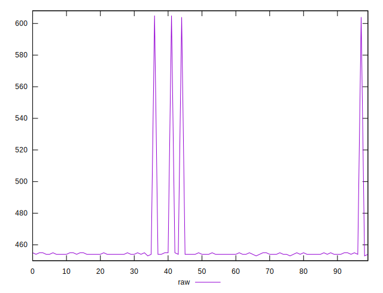
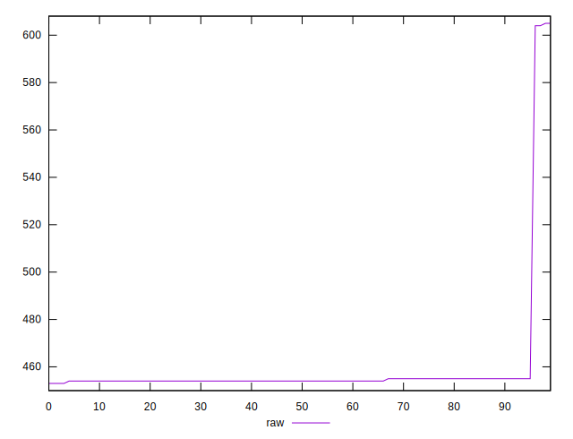

# //uses-rel-preload/samples/pages+cached+noexternal+noimg

[→ Parent](../..)


## Raw


```yaml
p90min: 454
p90max: 455
p90range: 1
p90mean: 454.31868131868134
p90median: 454
p90stdev: 0.4659651658706419
p90skewness: 0.7782499405501985
p90eccentricity: 0.9999999999999996
p90discretization: 45.5
outlandishness: 1.0263704680788315

```


## Score


```yaml
p90min: 0.6638888888888889
p90max: 0.6644444444444444
p90range: 0.0005555555555555314
p90mean: 0.664267399267399
p90median: 0.6644444444444444
p90stdev: 0.0002588695365947896
p90skewness: -0.7782499405474425
p90eccentricity: 0.9999999999999996
p90discretization: 45.5
outlandishness: 0.9900700835501762

```

