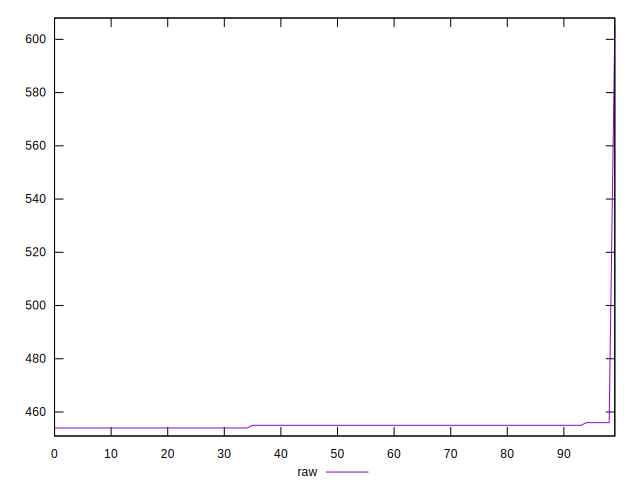

# //uses-rel-preload/samples/pages+cached+noexternal+nosvg

[→ Parent](../..)


## Raw


```yaml
p90min: 454
p90max: 456
p90range: 2
p90mean: 454.75824175824175
p90median: 455
p90stdev: 0.5414806591101061
p90skewness: -0.09433373333266858
p90eccentricity: 1.0000000000000002
p90discretization: 30.333333333333332
outlandishness: 1.0063508192827342

```


## Score


```yaml
p90min: 0.6633333333333333
p90max: 0.6644444444444444
p90range: 0.0011111111111110628
p90mean: 0.6640231990231994
p90median: 0.6638888888888889
p90stdev: 0.0003008225883944906
p90skewness: 0.09433373332866274
p90eccentricity: 1.0000000000000002
p90discretization: 30.333333333333332
outlandishness: 0.9975889585974259

```

