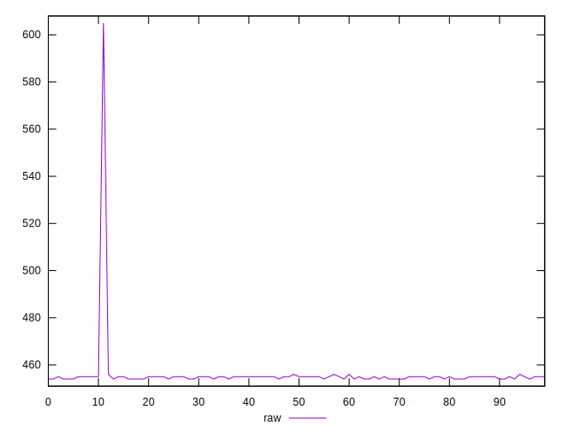

# //uses-rel-preload/samples/pages+cached+noexternal+nosvg

[→ Parent](../..)


## Raw


```yaml
p90min: 454
p90max: 455
p90range: 1
p90mean: 454.6111111111111
p90median: 455
p90stdev: 0.4874980215217847
p90skewness: -0.4558423058383966
p90eccentricity: 1.0000000000000027
p90discretization: 45
outlandishness: 1.0070023168092932

```


## Score


```yaml
p90min: 0.5805555555555555
p90max: 0.6644444444444444
p90range: 0.0838888888888889
p90mean: 0.6630864197530859
p90median: 0.6638888888888889
p90stdev: 0.008753251839841077
p90skewness: -9.311644916149113
p90eccentricity: 1.0000000000000024
p90discretization: 22.5
outlandishness: 1.000409649094013

```

