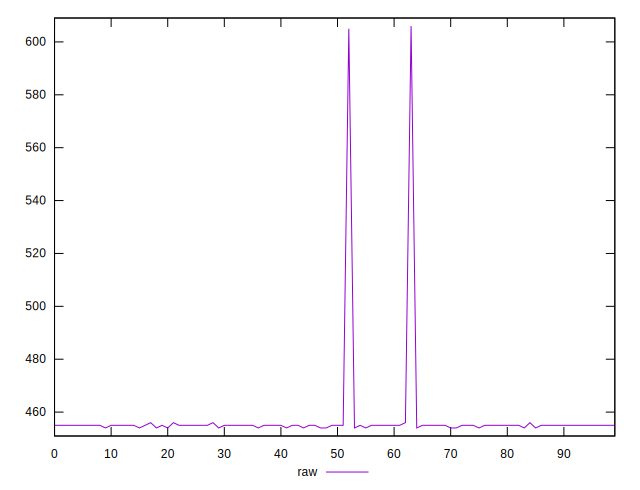
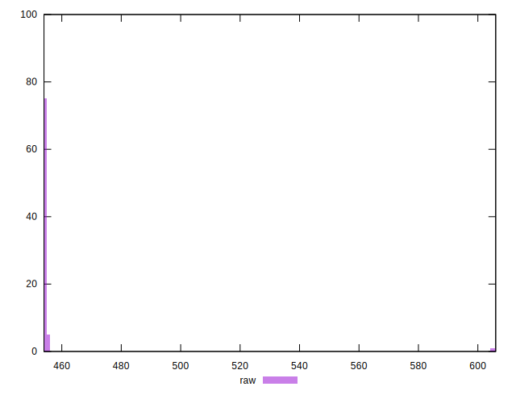
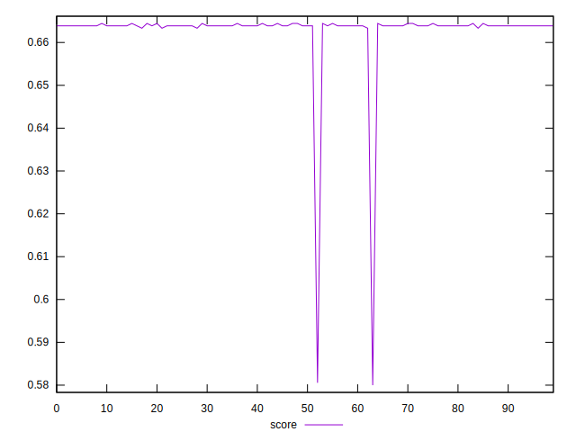
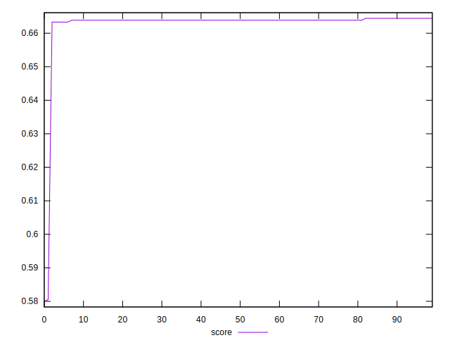

# //uses-rel-preload/samples/pages+cached+noexternal

[→ Parent](../..)


## Raw


```yaml
p90min: 454
p90max: 455
p90range: 1
p90mean: 454.8
p90median: 455
p90stdev: 0.4
p90skewness: -1.500000000000091
p90eccentricity: 1
p90discretization: 45
outlandishness: 1.013590277922815

```


## Score


```yaml
p90min: 0.58
p90max: 0.6644444444444444
p90range: 0.08444444444444443
p90mean: 0.66204938271605
p90median: 0.6638888888888889
p90stdev: 0.012329396670263532
p90skewness: -6.4796463232134505
p90eccentricity: 1.0000000000000024
p90discretization: 18
outlandishness: 1.0007236605049308

```

