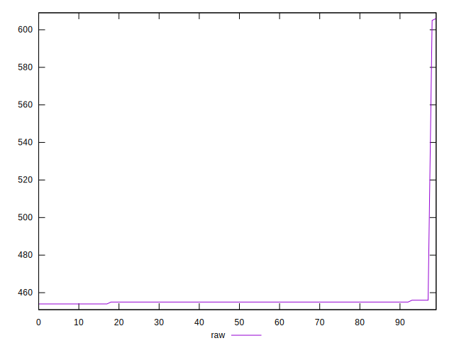
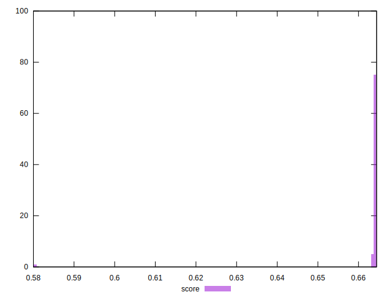

# //uses-rel-preload/samples/pages+cached+noexternal

[→ Parent](../..)


## Raw


```yaml
p90min: 454
p90max: 456
p90range: 2
p90mean: 454.9340659340659
p90median: 455
p90stdev: 0.41409766332784126
p90skewness: -0.446834872468385
p90eccentricity: 0.9999999999999988
p90discretization: 30.333333333333332
outlandishness: 1.0129929698075257

```


## Score


```yaml
p90min: 0.6633333333333333
p90max: 0.6644444444444444
p90range: 0.0011111111111110628
p90mean: 0.6639255189255197
p90median: 0.6638888888888889
p90stdev: 0.00023005425740434612
p90skewness: 0.4468348724571203
p90eccentricity: 0.9999999999999996
p90discretization: 30.333333333333332
outlandishness: 0.995075915061523

```


## P Score


```yaml
p90min: 0.6633333333333333
p90max: 0.6644444444444444
p90range: 0.0011111111111110628
p90mean: 0.6639255189255197
p90median: 0.6638888888888889
p90stdev: 0.00023005425740434612
p90skewness: 0.4468348724571203
p90eccentricity: 0.9999999999999996
p90discretization: 30.333333333333332
outlandishness: 0.995075915061523

```


## Score Difference


```yaml
p90min: -0.004444444444444362
p90max: -0.0033333333333332993
p90range: 0.0011111111111110628
p90mean: -0.003925518925518866
p90median: -0.0038888888888888307
p90stdev: 0.00023005425740434615
p90skewness: -0.4468348724684337
p90eccentricity: 1.0000000000000009
p90discretization: 30.333333333333332
outlandishness: 0.9814245529678381

```


## P Score Difference


```yaml
p90min: 0
p90max: 0
p90range: 0
p90mean: 0
p90median: 0
p90stdev: 0
p90skewness: .nan
p90eccentricity: .nan
p90discretization: 91
outlandishness: .nan

```

