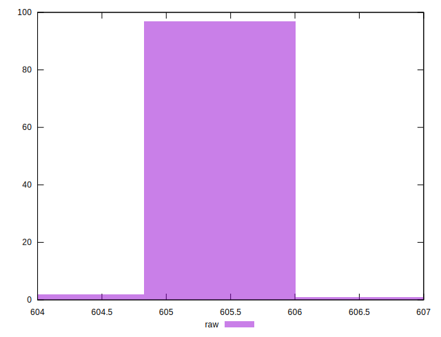
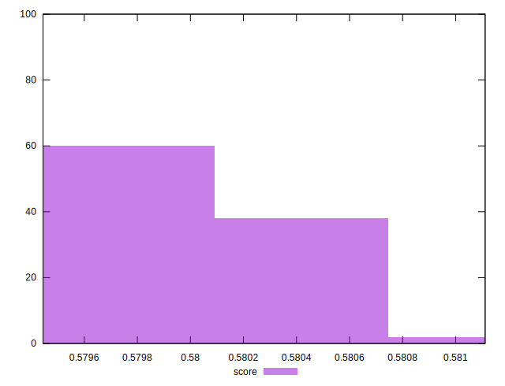

# //uses-rel-preload/samples/pages+cached+nointeractive

[→ Parent](../..)


## Raw


```yaml
p90min: 605
p90max: 606
p90range: 1
p90mean: 605.6483516483516
p90median: 606
p90stdev: 0.47748485675605323
p90skewness: -0.6213878670813775
p90eccentricity: 1.0000000000000018
p90discretization: 45.5
outlandishness: 0.9998073177703664

```


## Score


```yaml
p90min: 0.58
p90max: 0.5805555555555555
p90range: 0.0005555555555555314
p90mean: 0.5801953601953596
p90median: 0.58
p90stdev: 0.0002652693648644624
p90skewness: 0.6213878670893171
p90eccentricity: 1.0000000000000013
p90discretization: 45.5
outlandishness: 1.00011175024926

```

