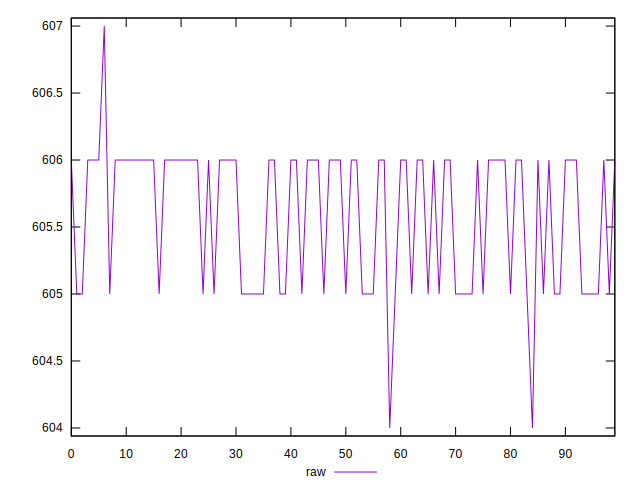
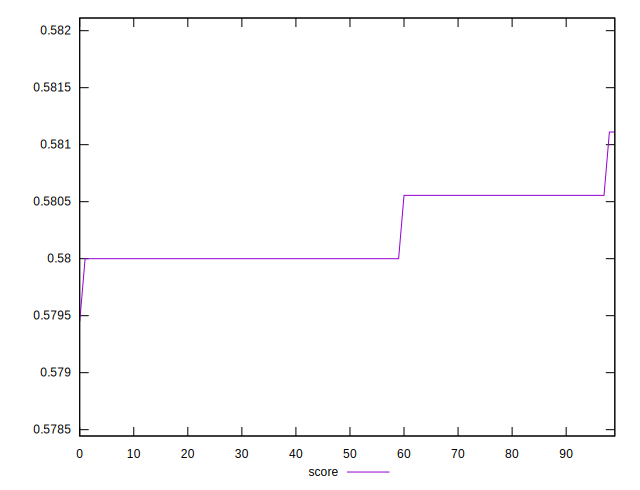

# //uses-rel-preload/samples/pages+cached+nointeractive

[→ Parent](../..)


## Raw


```yaml
p90min: 604
p90max: 606
p90range: 2
p90mean: 605.5333333333333
p90median: 606
p90stdev: 0.541602560309064
p90skewness: -0.552046686816233
p90eccentricity: 0.9999999999999993
p90discretization: 30
outlandishness: 1.000187171589145

```


## Score


```yaml
p90min: 0.5794444444444444
p90max: 0.5805555555555555
p90range: 0.0011111111111110628
p90mean: 0.5801790123456785
p90median: 0.58
p90stdev: 0.0002725153093165822
p90skewness: 0.4758991574935031
p90eccentricity: 0.9999999999999993
p90discretization: 30
outlandishness: 1.0001681118430226

```

