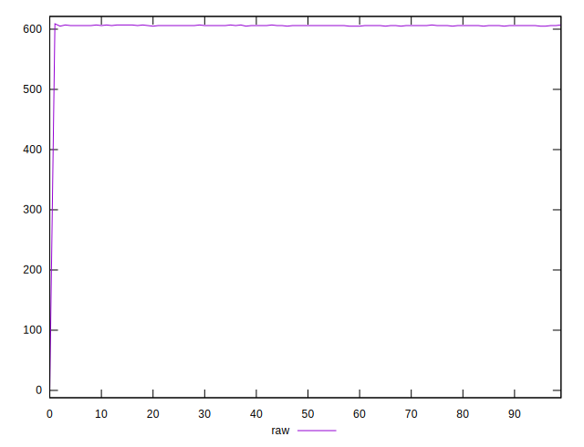
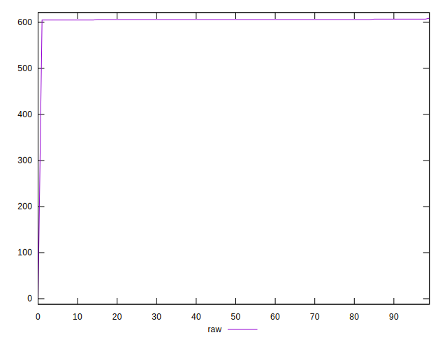
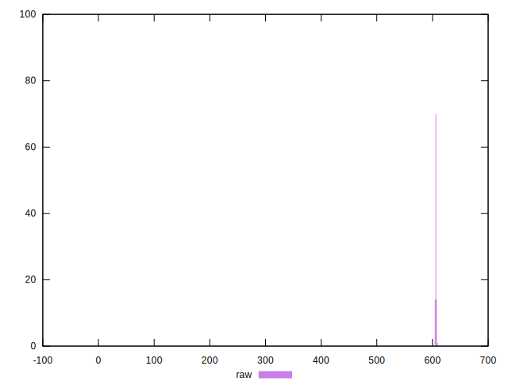
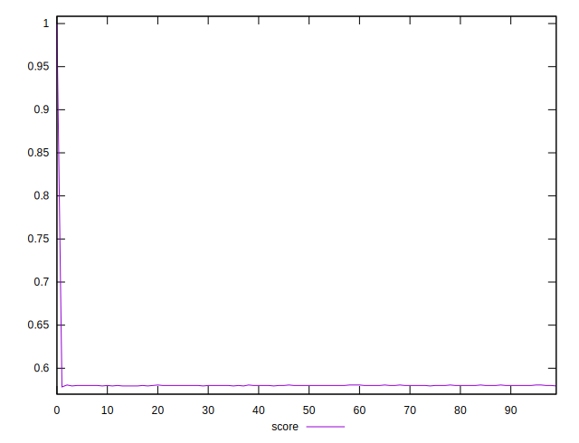
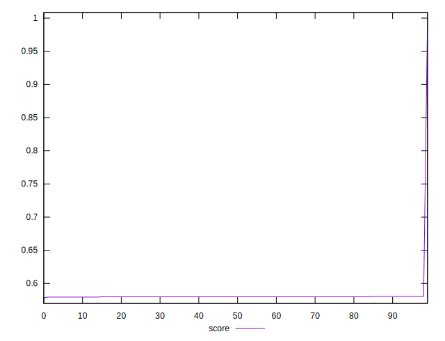
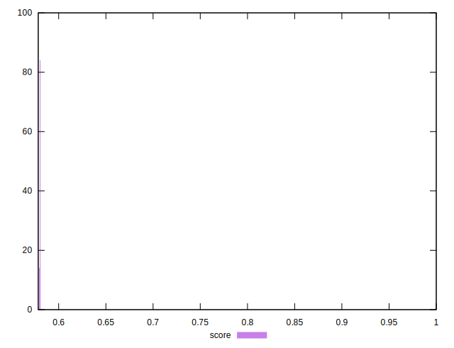

# //uses-rel-preload/samples/pages+cached

[→ Parent](../..)


## Raw


```yaml
p90min: 0
p90max: 607
p90range: 607
p90mean: 599.1666666666666
p90median: 606
p90stdev: 63.513122003777035
p90skewness: -9.327268475722661
p90eccentricity: 1.0000000000000013
p90discretization: 22.5
outlandishness: 1.002683299699591

```


## Score


```yaml
p90min: 0.5783333333333334
p90max: 0.5805555555555555
p90range: 0.0022222222222221255
p90mean: 0.5799259259259248
p90median: 0.58
p90stdev: 0.0003008903112828005
p90skewness: -1.7643113706999967
p90eccentricity: 0.9999999999999978
p90discretization: 22.5
outlandishness: 1.0147364849841278

```

