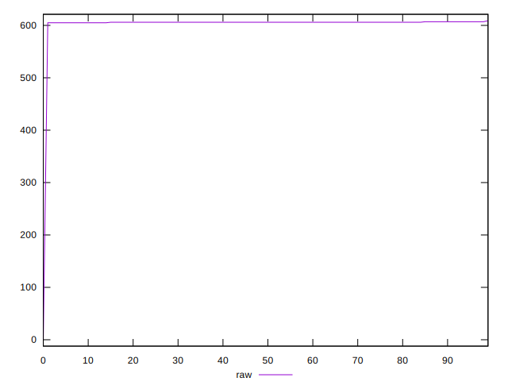

# //uses-rel-preload/samples/pages+cached

[→ Parent](../..)


## Raw


```yaml
p90min: 605
p90max: 607
p90range: 2
p90mean: 605.9230769230769
p90median: 606
p90stdev: 0.47418569253607495
p90skewness: -0.23052517739623668
p90eccentricity: 1.0000000000000022
p90discretization: 30.333333333333332
outlandishness: 0.9804469140240157

```


## Score


```yaml
p90min: 0.5794444444444444
p90max: 0.5805555555555555
p90range: 0.0011111111111110628
p90mean: 0.5800427350427341
p90median: 0.58
p90stdev: 0.0002634364958533636
p90skewness: 0.23052517740315365
p90eccentricity: 0.9999999999999996
p90discretization: 30.333333333333332
outlandishness: 1.0143278304812773

```

