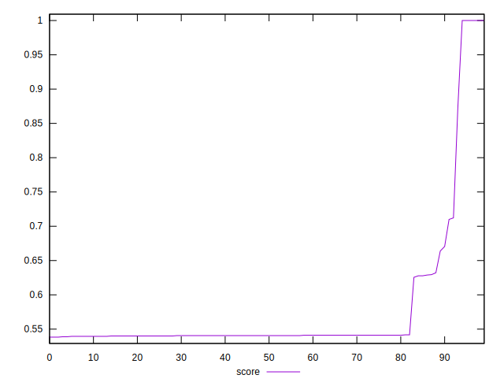
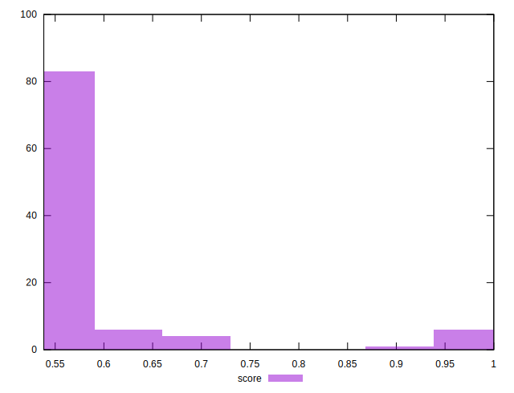

# //uses-rel-preload/samples/pages

[→ Parent](../..)


## Raw


```yaml
p90min: 0
p90max: 679
p90range: 679
p90mean: 603.5444444444445
p90median: 677
p90stdev: 182.03651410949345
p90skewness: -2.6124377432693313
p90eccentricity: 0.9999999999999993
p90discretization: 5.625
outlandishness: 1.0254288764643862

```


## Score


```yaml
p90min: 0.5383333333333333
p90max: 0.6638888888888889
p90range: 0.12555555555555553
p90mean: 0.5476481481481491
p90median: 0.5405555555555556
p90stdev: 0.025227096119070543
p90skewness: 3.272314406042671
p90eccentricity: 0.9999999999999984
p90discretization: 6.923076923076923
outlandishness: 1.1314684734179743

```

