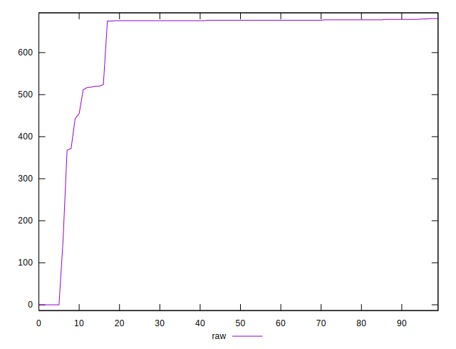

# //uses-rel-preload/samples/pages

[→ Parent](../..)


## Raw


```yaml
p90min: 443
p90max: 681
p90range: 238
p90mean: 661.8021978021978
p90median: 677
p90stdev: 50.70735251978029
p90skewness: -3.0928341153816774
p90eccentricity: 1.0000000000000002
p90discretization: 6.5
outlandishness: 0.852840166521281

```


## Score


```yaml
p90min: 0.5383333333333333
p90max: 0.6705555555555556
p90range: 0.13222222222222224
p90mean: 0.5489987789987792
p90median: 0.5405555555555556
p90stdev: 0.028170751399877944
p90skewness: 3.0928341153816814
p90eccentricity: 1.0000000000000004
p90discretization: 6.5
outlandishness: 1.1259081098138446

```


## P Score


```yaml
p90min: 0.5383333333333333
p90max: 0.6705555555555556
p90range: 0.13222222222222224
p90mean: 0.5489987789987792
p90median: 0.5405555555555556
p90stdev: 0.028170751399877944
p90skewness: 3.0928341153816814
p90eccentricity: 1.0000000000000004
p90discretization: 6.5
outlandishness: 1.1259081098138446

```


## Score Difference


```yaml
p90min: -0.0022222222222222365
p90max: 0.0011111111111111738
p90range: 0.0033333333333334103
p90mean: -0.0004273504273503953
p90median: -0.0005555555555555314
p90stdev: 0.0006489136172306329
p90skewness: 0.20638234816530673
p90eccentricity: 1.0000000000000013
p90discretization: 11.375
outlandishness: 0.6185822499999797

```


## P Score Difference


```yaml
p90min: 0
p90max: 0
p90range: 0
p90mean: 0
p90median: 0
p90stdev: 0
p90skewness: .nan
p90eccentricity: .nan
p90discretization: 91
outlandishness: .nan

```

