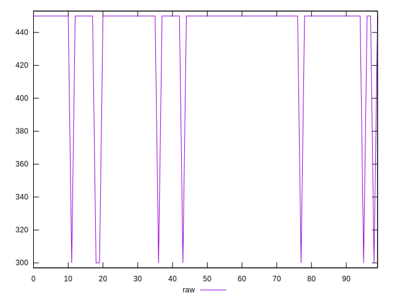
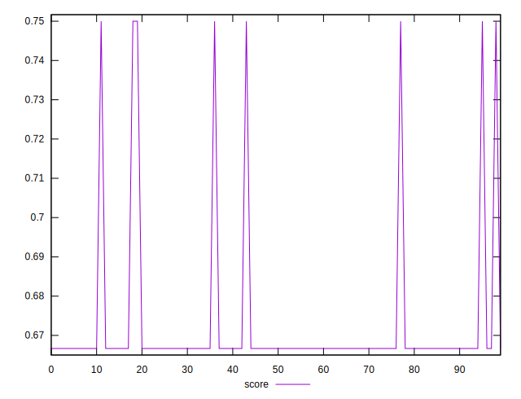
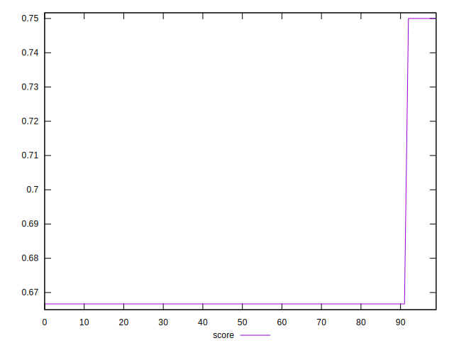
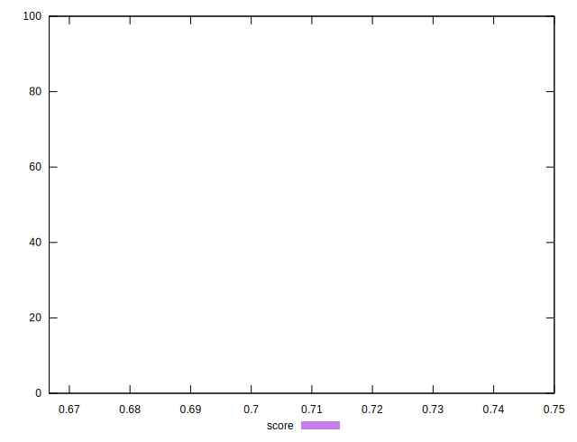

# //uses-text-compression/samples/pages+cached+noexternal+nocss

[→ Parent](../..)


## Raw


```yaml
p90min: 450
p90max: 450
p90range: 0
p90mean: 450
p90median: 450
p90stdev: 0
p90skewness: .nan
p90eccentricity: .nan
p90discretization: 91
outlandishness: 0.9473777777777779

```


## Score


```yaml
p90min: 0.6666666666666666
p90max: 0.6666666666666666
p90range: 0
p90mean: 0.6666666666666657
p90median: 0.6666666666666666
p90stdev: 8.881784197001252e-16
p90skewness: 1
p90eccentricity: 1
p90discretization: 91
outlandishness: 1.0201000000000005

```


## P Score


```yaml
p90min: 0.6666666666666666
p90max: 0.6666666666666666
p90range: 0
p90mean: 0.6666666666666657
p90median: 0.6666666666666666
p90stdev: 8.881784197001252e-16
p90skewness: 1
p90eccentricity: 1
p90discretization: 91
outlandishness: 1.0201000000000005

```


## Score Difference


```yaml
p90min: 0.0033333333333334103
p90max: 0.0033333333333334103
p90range: 0
p90mean: 0.0033333333333334103
p90median: 0.0033333333333334103
p90stdev: 0
p90skewness: .nan
p90eccentricity: .nan
p90discretization: 91
outlandishness: 0.8464

```


## P Score Difference


```yaml
p90min: 0
p90max: 0
p90range: 0
p90mean: 0
p90median: 0
p90stdev: 0
p90skewness: .nan
p90eccentricity: .nan
p90discretization: 91
outlandishness: .nan

```

