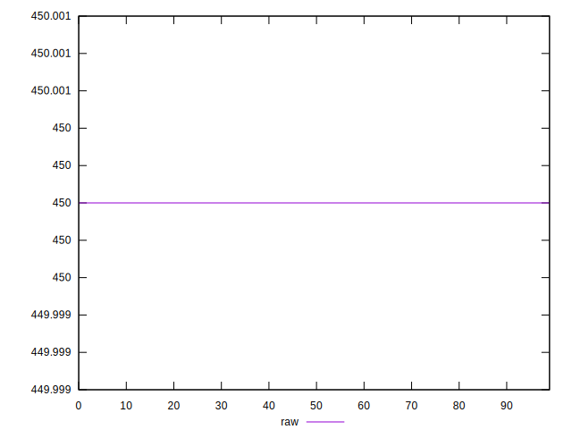
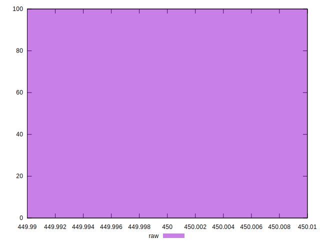
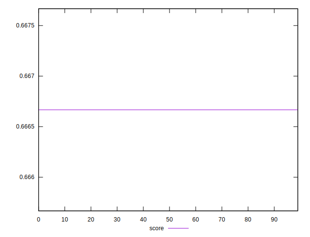
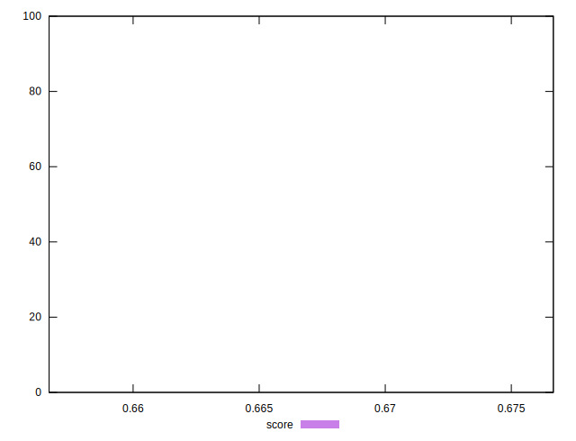

# //uses-text-compression/samples/pages+cached+noexternal+nofonts+nosvg+noimg+nocss

[→ Parent](../..)


## Raw


```yaml
p90min: 450
p90max: 450
p90range: 0
p90mean: 450
p90median: 450
p90stdev: 0
p90skewness: .nan
p90eccentricity: .nan
p90discretization: 90
outlandishness: 1

```


## Score


```yaml
p90min: 0.6666666666666666
p90max: 0.6666666666666666
p90range: 0
p90mean: 0.6666666666666659
p90median: 0.6666666666666666
p90stdev: 7.771561172376096e-16
p90skewness: 1
p90eccentricity: 1
p90discretization: 90
outlandishness: 1

```

