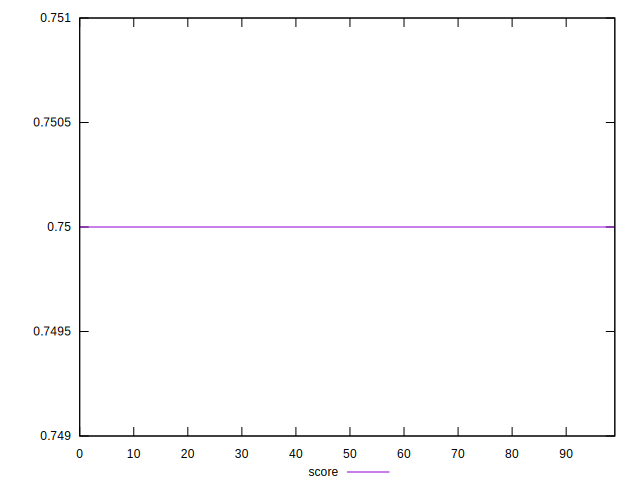
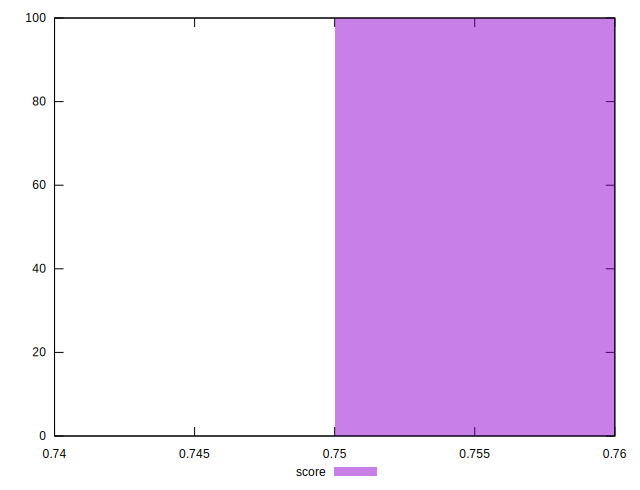

# //uses-text-compression/samples/pages+cached+noexternal+nojs

[→ Parent](../..)


## Raw


```yaml
p90min: 300
p90max: 300
p90range: 0
p90mean: 300
p90median: 300
p90stdev: 0
p90skewness: .nan
p90eccentricity: .nan
p90discretization: 91
outlandishness: 1

```


## Score


```yaml
p90min: 0.75
p90max: 0.75
p90range: 0
p90mean: 0.75
p90median: 0.75
p90stdev: 0
p90skewness: .nan
p90eccentricity: .nan
p90discretization: 91
outlandishness: 1

```

