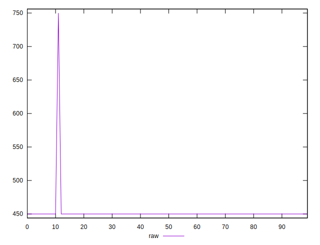
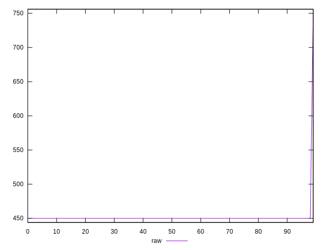
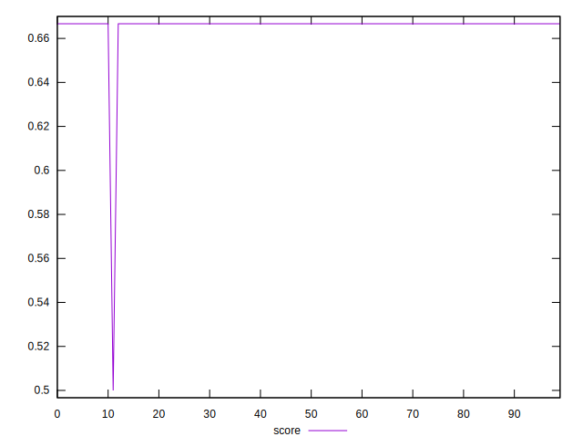
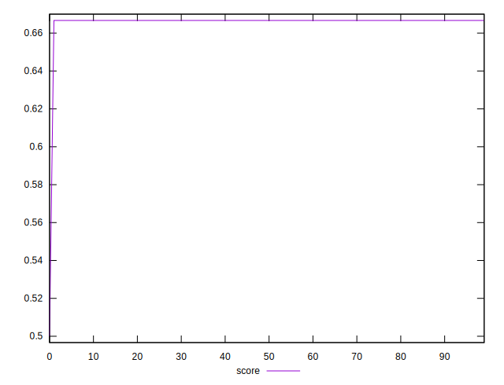
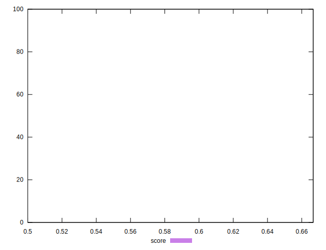

# //uses-text-compression/samples/pages+cached+noexternal+nosvg

[→ Parent](../..)


## Raw


```yaml
p90min: 450
p90max: 450
p90range: 0
p90mean: 450
p90median: 450
p90stdev: 0
p90skewness: .nan
p90eccentricity: .nan
p90discretization: 90
outlandishness: 1.0133777777777777

```


## Score


```yaml
p90min: 0.5
p90max: 0.6666666666666666
p90range: 0.16666666666666663
p90mean: 0.664814814814814
p90median: 0.6666666666666666
p90stdev: 0.01747033542973445
p90skewness: -9.327981344055775
p90eccentricity: 1.0000000000000036
p90discretization: 45
outlandishness: 1.0005571806550233

```

