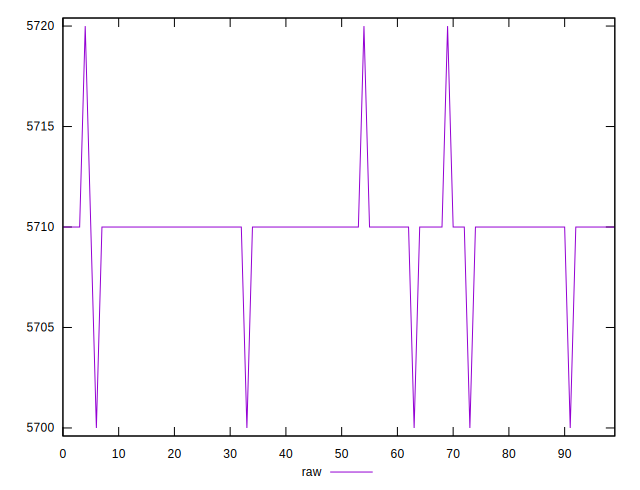
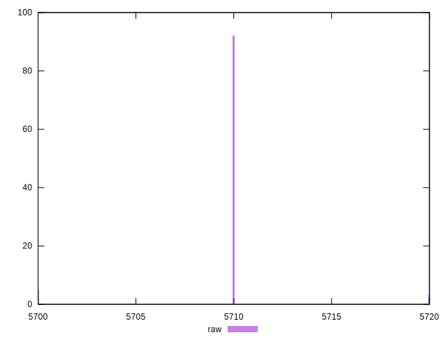

# //uses-text-compression/samples/pages+cached+nointeractive

[→ Parent](../..)


## Raw


```yaml
p90min: 5700
p90max: 5710
p90range: 10
p90mean: 5709.444444444444
p90median: 5710
p90stdev: 2.290614236454256
p90skewness: -3.8805700005811983
p90eccentricity: 0.9999999999999962
p90discretization: 45
outlandishness: 1.000124553844117

```


## Score


```yaml
p90min: 0
p90max: 0
p90range: 0
p90mean: 0
p90median: 0
p90stdev: 0
p90skewness: .nan
p90eccentricity: .nan
p90discretization: 90
outlandishness: .nan

```

