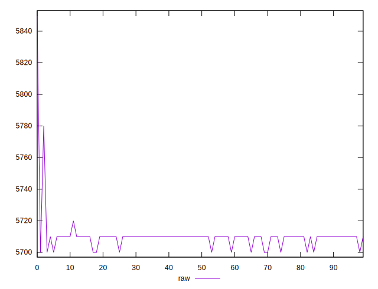
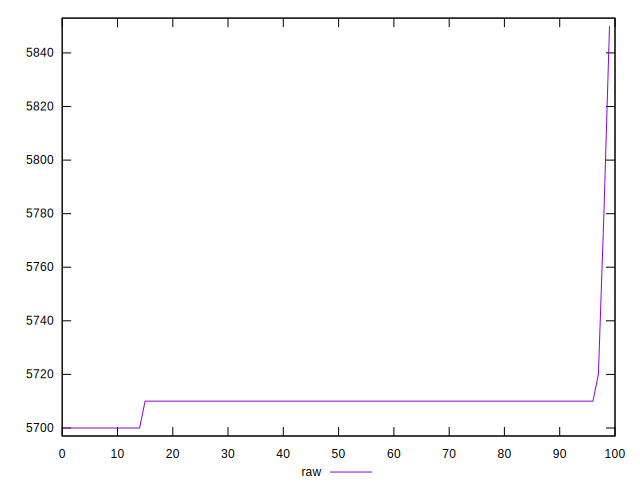
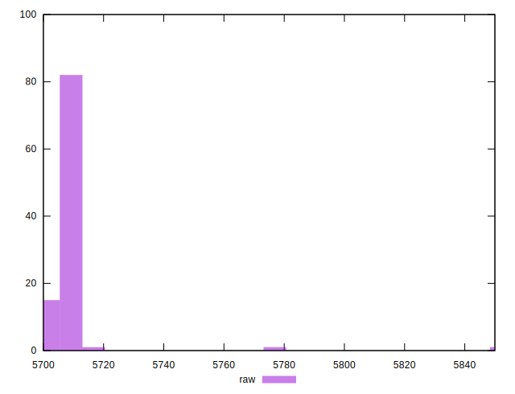

# //uses-text-compression/samples/pages+cached

[→ Parent](../..)


## Raw


```yaml
p90min: 5700
p90max: 5720
p90range: 20
p90mean: 5709.2307692307695
p90median: 5710
p90stdev: 3.049326796815737
p90skewness: -1.9401278742123111
p90eccentricity: 1.0000000000000027
p90discretization: 30.333333333333332
outlandishness: 1.0005147522938824

```


## Score


```yaml
p90min: 0
p90max: 0
p90range: 0
p90mean: 0
p90median: 0
p90stdev: 0
p90skewness: .nan
p90eccentricity: .nan
p90discretization: 91
outlandishness: .nan

```

