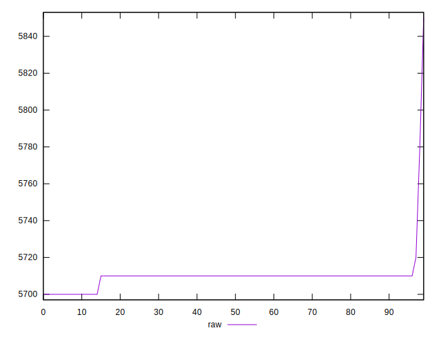

# //uses-text-compression/samples/pages+cached

[→ Parent](../..)


## Raw


```yaml
p90min: 5700
p90max: 5710
p90range: 10
p90mean: 5708.333333333333
p90median: 5710
p90stdev: 3.726779962499649
p90skewness: -1.7888543819995806
p90eccentricity: 1.0000000000000009
p90discretization: 45
outlandishness: 1.0008293689722416

```


## Score


```yaml
p90min: 0
p90max: 0
p90range: 0
p90mean: 0
p90median: 0
p90stdev: 0
p90skewness: .nan
p90eccentricity: .nan
p90discretization: 90
outlandishness: .nan

```

