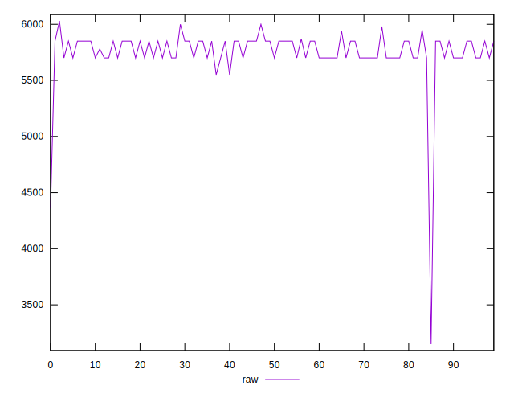
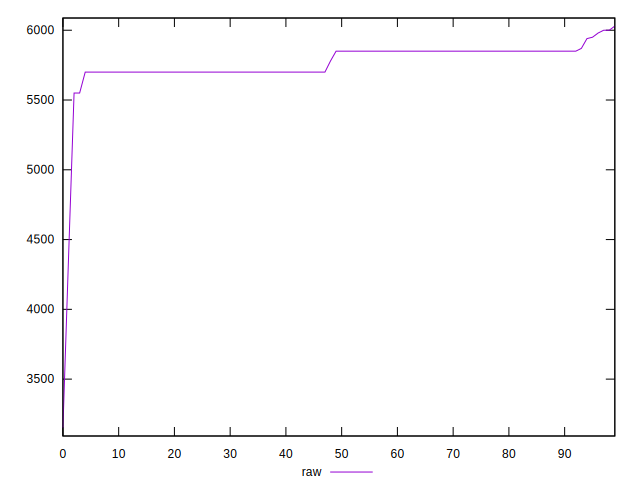
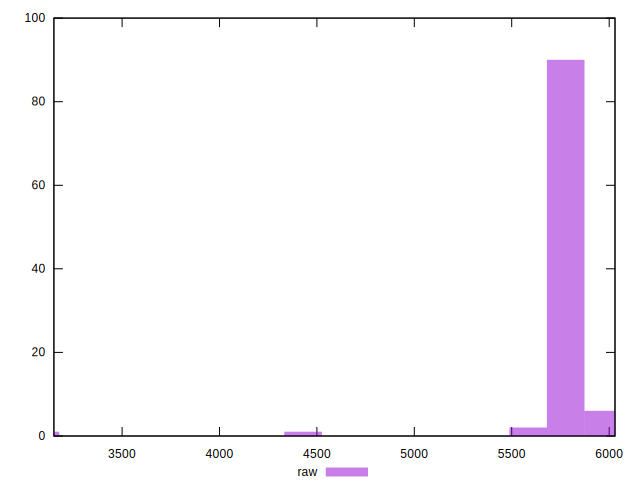
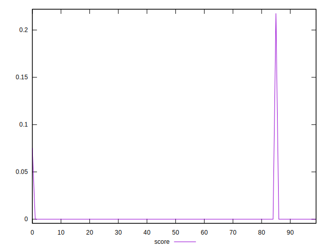
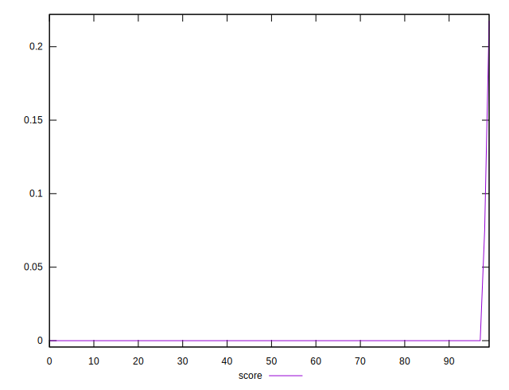
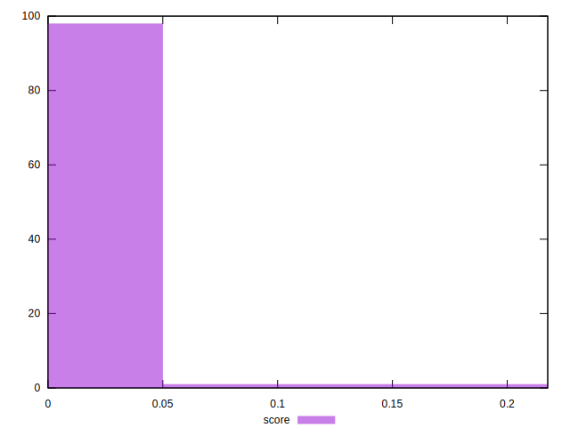

# //uses-text-compression/samples/pages

[→ Parent](../..)


## Raw


```yaml
p90min: 3150
p90max: 5850
p90range: 2700
p90mean: 5722.666666666667
p90median: 5700
p90stdev: 320.16939960659016
p90skewness: -6.596147994169392
p90eccentricity: 0.9999999999999954
p90discretization: 15
outlandishness: 1.0073293173584617

```


## Score


```yaml
p90min: 0
p90max: 0
p90range: 0
p90mean: 0
p90median: 0
p90stdev: 0
p90skewness: .nan
p90eccentricity: .nan
p90discretization: 90
outlandishness: .inf

```

