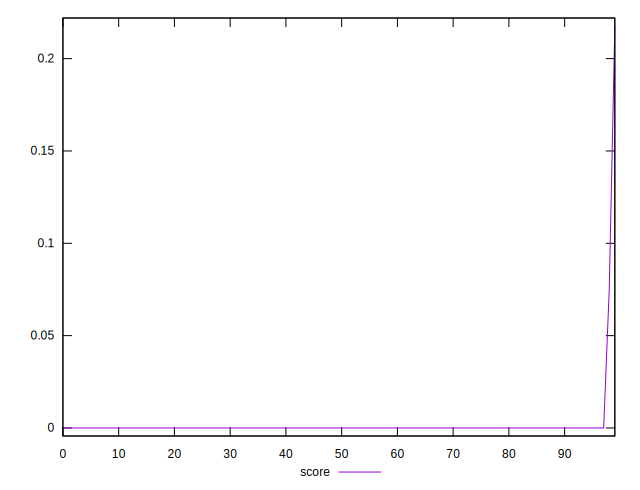

# //uses-text-compression/samples/pages

[→ Parent](../..)


## Raw


```yaml
p90min: 5550
p90max: 5870
p90range: 320
p90mean: 5773.626373626374
p90median: 5780
p90stdev: 78.06050743439573
p90skewness: -0.1905483316408414
p90eccentricity: 0.9999999999999996
p90discretization: 18.2
outlandishness: 0.9896258282150646

```


## Score


```yaml
p90min: 0
p90max: 0
p90range: 0
p90mean: 0
p90median: 0
p90stdev: 0
p90skewness: .nan
p90eccentricity: .nan
p90discretization: 91
outlandishness: .inf

```

