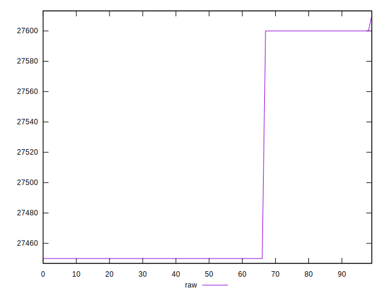

# //uses-webp-images/samples/pages+cached+noadtech

[→ Parent](../..)


## Raw


```yaml
p90min: 27450
p90max: 27600
p90range: 150
p90mean: 27489.56043956044
p90median: 27450
p90stdev: 66.09869556845081
p90skewness: 1.0723225363157458
p90eccentricity: 0.9999999999999992
p90discretization: 45.5
outlandishness: 1.0007305605161259

```


## Score


```yaml
p90min: 0
p90max: 0
p90range: 0
p90mean: 0
p90median: 0
p90stdev: 0
p90skewness: .nan
p90eccentricity: .nan
p90discretization: 91
outlandishness: .nan

```

