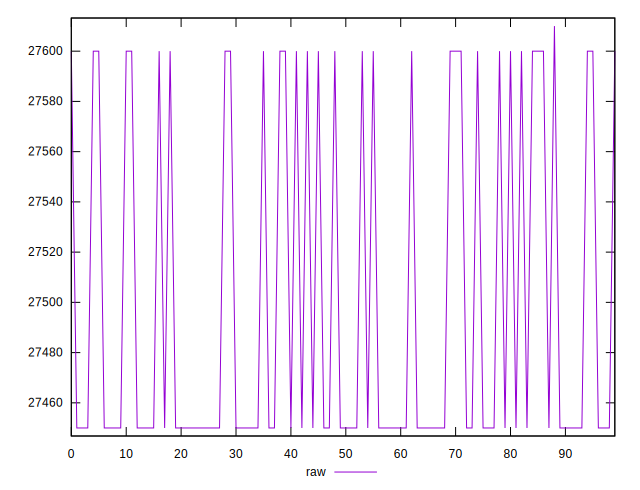

# //uses-webp-images/samples/pages+cached+noadtech

[→ Parent](../..)


## Raw


```yaml
p90min: 27450
p90max: 27600
p90range: 150
p90mean: 27488.333333333332
p90median: 27450
p90stdev: 65.42595475463524
p90skewness: 1.1208599646479156
p90eccentricity: 0.9999999999999948
p90discretization: 45
outlandishness: 1.000819909702721

```


## Score


```yaml
p90min: 0
p90max: 0
p90range: 0
p90mean: 0
p90median: 0
p90stdev: 0
p90skewness: .nan
p90eccentricity: .nan
p90discretization: 90
outlandishness: .nan

```

