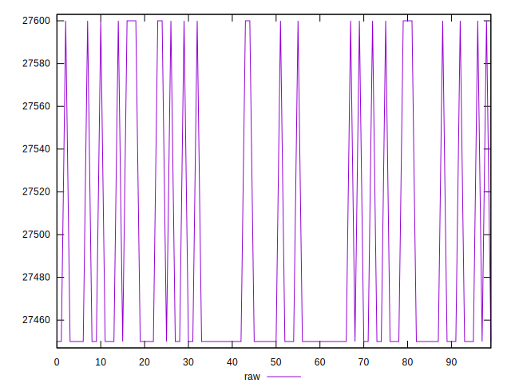
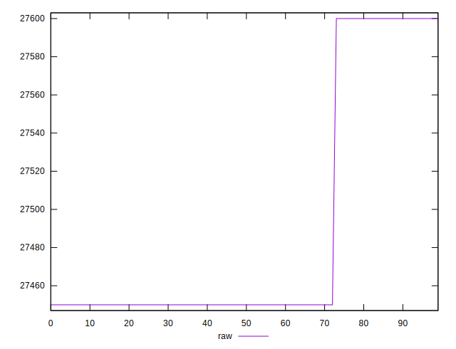

# //uses-webp-images/samples/pages+cached+noexternal+nofonts

[→ Parent](../..)


## Raw


```yaml
p90min: 27450
p90max: 27600
p90range: 150
p90mean: 27478.333333333332
p90median: 27450
p90stdev: 58.71304984602839
p90skewness: 1.589652276250315
p90eccentricity: 1.0000000000000029
p90discretization: 45
outlandishness: 1.0008857422359185

```


## Score


```yaml
p90min: 0
p90max: 0
p90range: 0
p90mean: 0
p90median: 0
p90stdev: 0
p90skewness: .nan
p90eccentricity: .nan
p90discretization: 90
outlandishness: .nan

```

