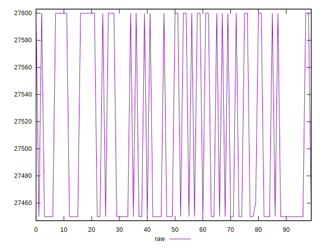
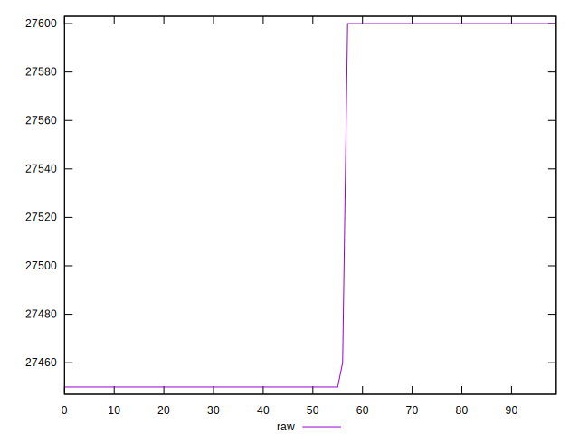
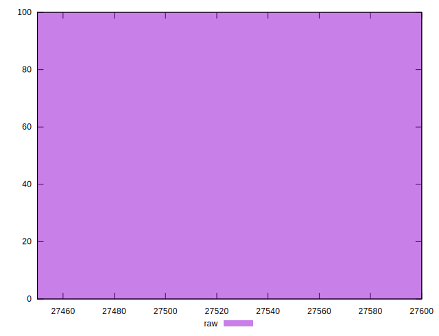

# //uses-webp-images/samples/pages+cached+noexternal

[→ Parent](../..)


## Raw


```yaml
p90min: 27450
p90max: 27600
p90range: 150
p90mean: 27505.11111111111
p90median: 27450
p90stdev: 72.20717792027244
p90skewness: 0.5527479059151834
p90eccentricity: 0.9999999999999986
p90discretization: 30
outlandishness: 1.0006900917883441

```


## Score


```yaml
p90min: 0
p90max: 0
p90range: 0
p90mean: 0
p90median: 0
p90stdev: 0
p90skewness: .nan
p90eccentricity: .nan
p90discretization: 90
outlandishness: .nan

```

