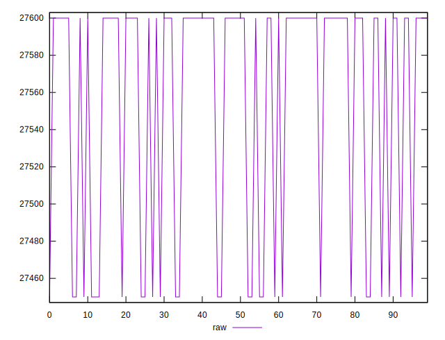
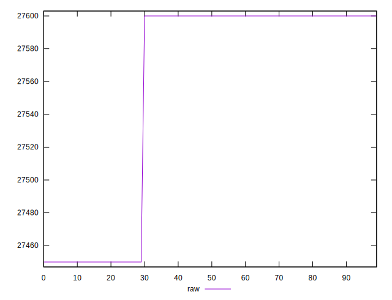
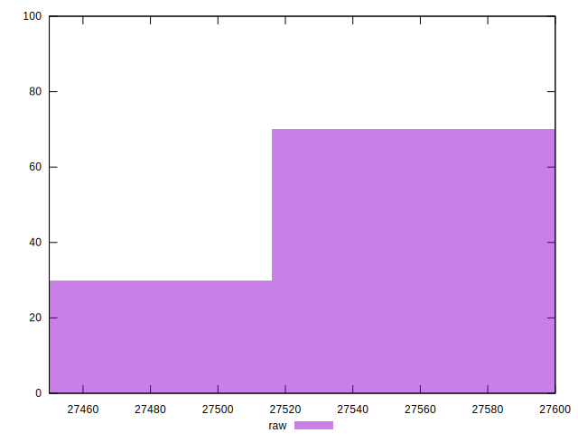

# //uses-webp-images/samples/pages+cached+nointeractive

[→ Parent](../..)


## Raw


```yaml
p90min: 27450
p90max: 27600
p90range: 150
p90mean: 27550
p90median: 27600
p90stdev: 70.71067811865476
p90skewness: -0.7071067811865451
p90eccentricity: 0.9999999999999999
p90discretization: 45
outlandishness: 1.0003630093445013

```


## Score


```yaml
p90min: 0
p90max: 0
p90range: 0
p90mean: 0
p90median: 0
p90stdev: 0
p90skewness: .nan
p90eccentricity: .nan
p90discretization: 90
outlandishness: .nan

```

