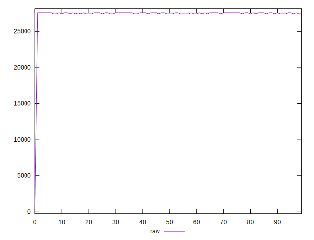
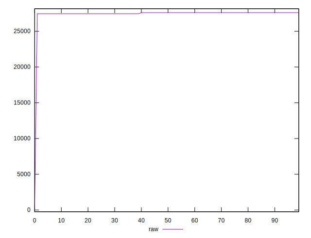
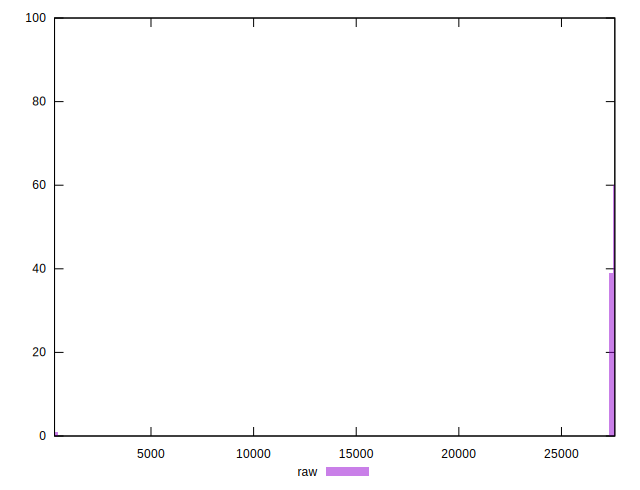

# //uses-webp-images/samples/pages+cached

[→ Parent](../..)


## Raw


```yaml
p90min: 27450
p90max: 27600
p90range: 150
p90mean: 27535.824175824175
p90median: 27600
p90stdev: 74.11108285771238
p90skewness: -0.2892410119522132
p90eccentricity: 1.0000000000000013
p90discretization: 30.333333333333332
outlandishness: 0.9806849780723754

```


## Score


```yaml
p90min: 0
p90max: 0
p90range: 0
p90mean: 0
p90median: 0
p90stdev: 0
p90skewness: .nan
p90eccentricity: .nan
p90discretization: 91
outlandishness: .inf

```

