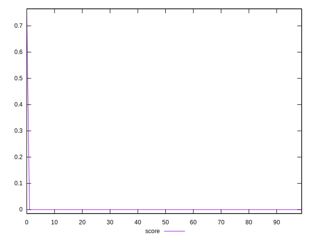

# //uses-webp-images/samples/pages+cached

[→ Parent](../..)


## Raw


```yaml
p90min: 300
p90max: 27600
p90range: 27300
p90mean: 27231.777777777777
p90median: 27600
p90stdev: 2855.718853955954
p90skewness: -9.318406736009225
p90eccentricity: 1.0000000000000007
p90discretization: 22.5
outlandishness: 1.0027061852244845

```


## Score


```yaml
p90min: 0
p90max: 0
p90range: 0
p90mean: 0
p90median: 0
p90stdev: 0
p90skewness: .nan
p90eccentricity: .nan
p90discretization: 90
outlandishness: .inf

```

