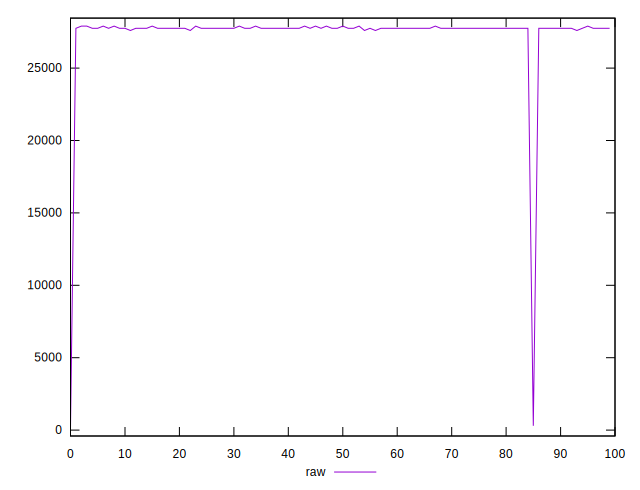
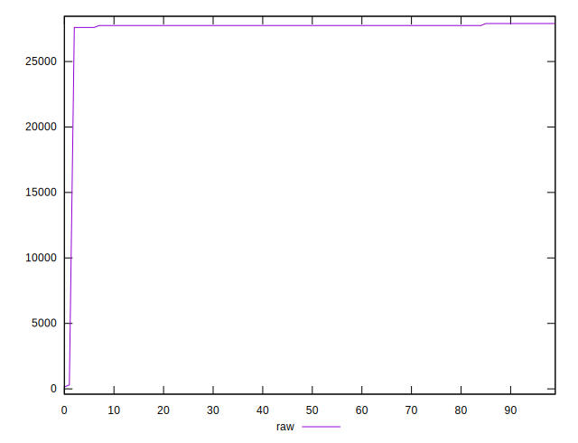
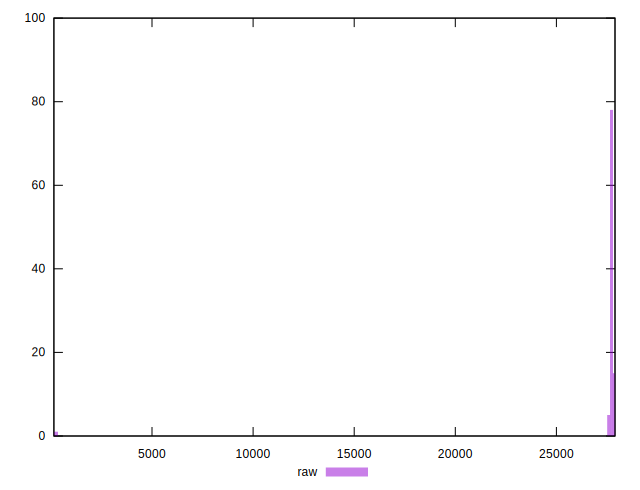
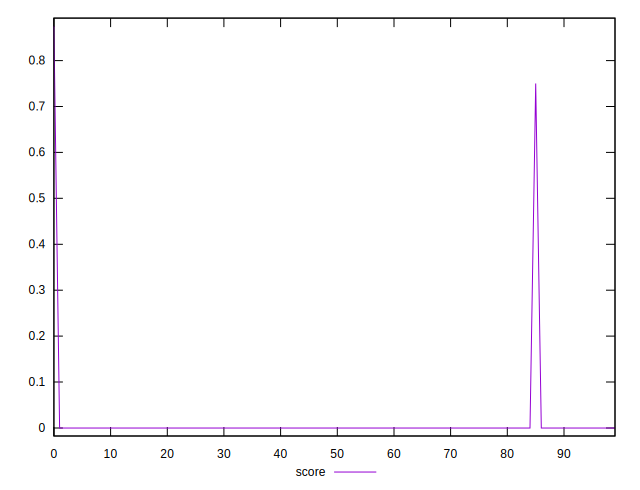
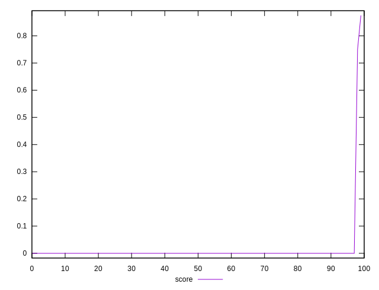
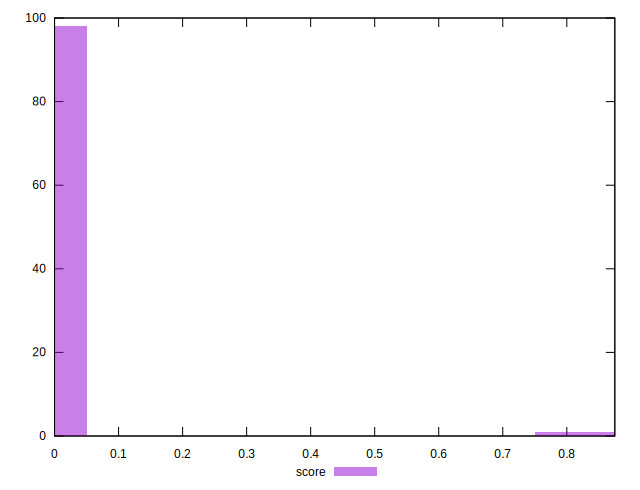

# //uses-webp-images/samples/pages

[→ Parent](../..)


## Raw


```yaml
p90min: 27600
p90max: 27900
p90range: 300
p90mean: 27754.945054945056
p90median: 27750
p90stdev: 56.47859900773126
p90skewness: 0.35425233293025216
p90eccentricity: 1.0000000000000036
p90discretization: 30.333333333333332
outlandishness: 0.9614351047437356

```


## Score


```yaml
p90min: 0
p90max: 0
p90range: 0
p90mean: 0
p90median: 0
p90stdev: 0
p90skewness: .nan
p90eccentricity: .nan
p90discretization: 91
outlandishness: .inf

```

