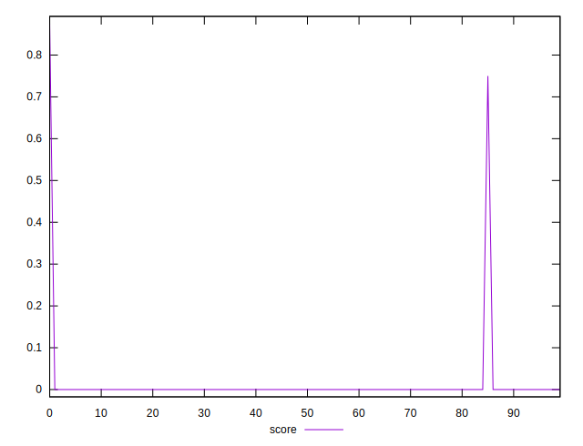
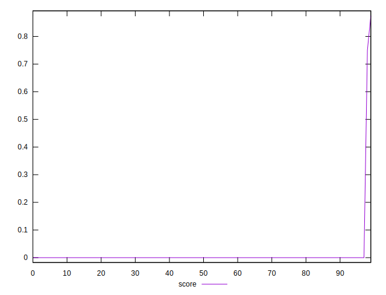

# //uses-webp-images/samples/pages

[→ Parent](../..)


## Raw


```yaml
p90min: 150
p90max: 27900
p90range: 27750
p90mean: 27138.333333333332
p90median: 27750
p90stdev: 4057.661135295663
p90skewness: -6.4810260872121415
p90eccentricity: 1.000000000000002
p90discretization: 18
outlandishness: 1.0056210932869272

```


## Score


```yaml
p90min: 0
p90max: 0
p90range: 0
p90mean: 0
p90median: 0
p90stdev: 0
p90skewness: .nan
p90eccentricity: .nan
p90discretization: 90
outlandishness: .inf

```

