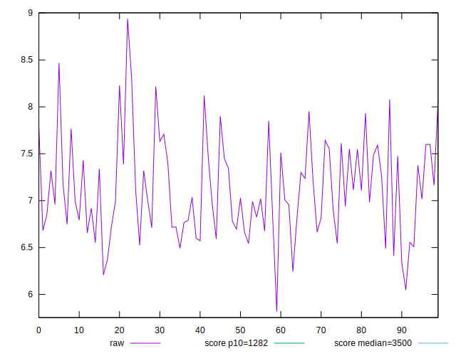
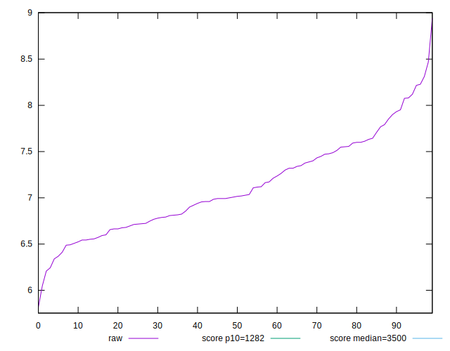
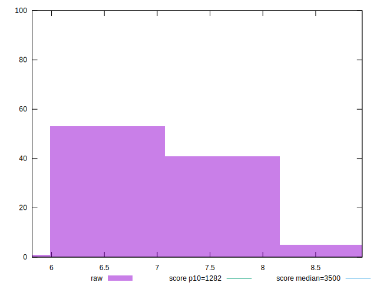
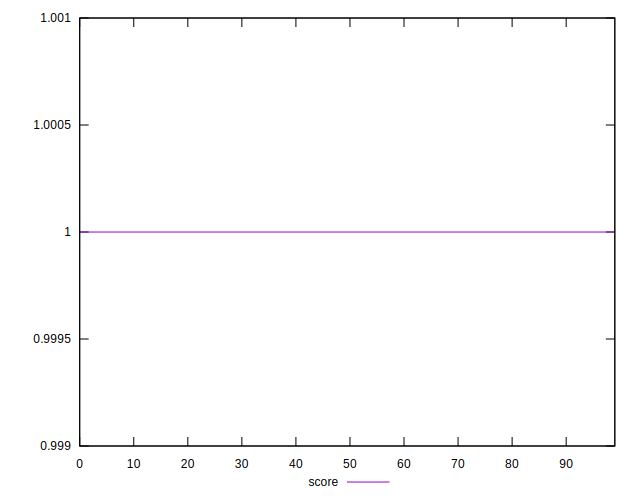
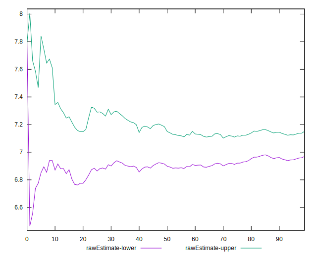
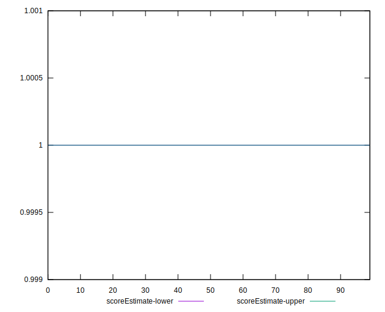
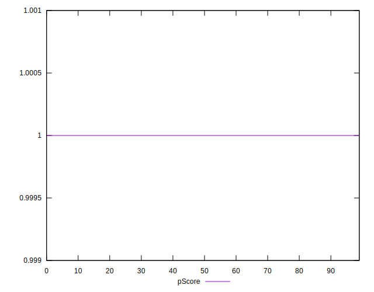
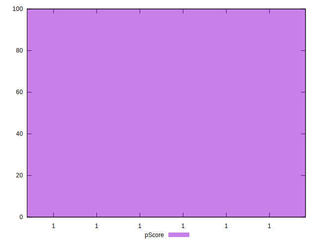
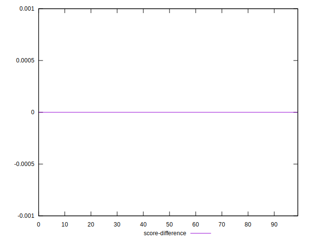
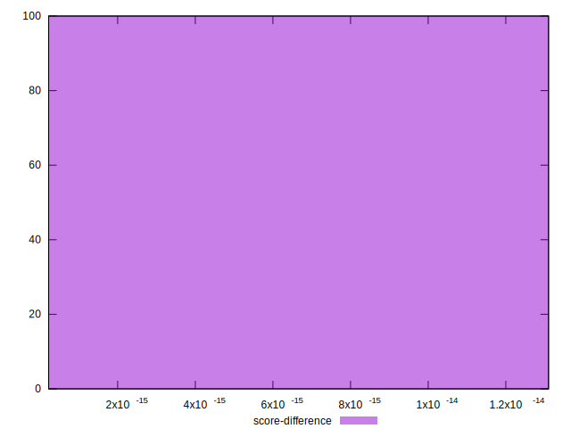

# //bootup-time/samples/pages+cached+noexternal+nofonts+nosvg+noimg+nocss+nojs

[→ Parent](../..)


## Raw


```yaml
p90min: 6.208000000000002
p90max: 8.076
p90range: 1.8679999999999986
p90mean: 7.0601758241758255
p90median: 6.992000000000002
p90stdev: 0.4411704361142571
p90skewness: 0.27562129125822177
p90eccentricity: 0.9999999999999997
p90discretization: 1.058139534883721
outlandishness: 1.0190309136153433
confidence: 0.22099018626247435
p90confidence: 0.18128580197635458

```


## Score


```yaml
p90min: 0.999999999999996
p90max: 0.9999999999999998
p90range: 3.774758283725532e-15
p90mean: 0.9999999999999993
p90median: 0.9999999999999989
p90stdev: 1.1165491329479315e-15
p90skewness: -1.8710207045195004
p90eccentricity: 0.9999999999999996
p90discretization: 3.5
outlandishness: 0.9999999999999993
confidence: 8.881784197001252e-16
p90confidence: 4.440892098500626e-16

```


## Raw Estimate


## Score Estimate


## P Score


```yaml
p90min: 0.999999999999996
p90max: 0.9999999999999998
p90range: 3.774758283725532e-15
p90mean: 0.9999999999999993
p90median: 0.9999999999999989
p90stdev: 1.1165491329479315e-15
p90skewness: -1.8710207045195004
p90eccentricity: 0.9999999999999996
p90discretization: 3.5
outlandishness: 0.9999999999999993
confidence: 8.881784197001252e-16
p90confidence: 4.440892098500626e-16

```


## Score Difference


```yaml
p90min: 2.220446049250313e-16
p90max: 3.9968028886505635e-15
p90range: 3.774758283725532e-15
p90mean: 1.3615482367930492e-15
p90median: 1.1102230246251565e-15
p90stdev: 8.735449318359137e-16
p90skewness: 1.0143505539353255
p90eccentricity: 0.9999999999999992
p90discretization: 3.5
outlandishness: 1.7600682199130273
confidence: 7.12235609977403e-16
p90confidence: 3.5895717520210373e-16

```


## P Score Difference


```yaml
p90min: 0
p90max: 0
p90range: 0
p90mean: 0
p90median: 0
p90stdev: 0
p90skewness: .nan
p90eccentricity: .nan
p90discretization: 91
outlandishness: .nan
confidence: 0
p90confidence: 0

```

