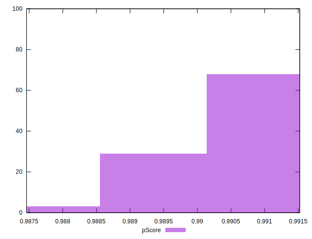
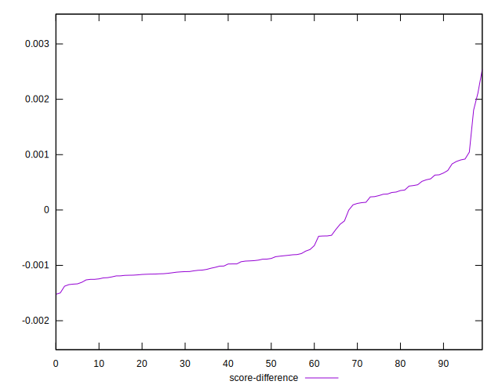

# //bootup-time/samples/pages+cached+nointeractive

[→ Parent](../..)


## Raw


```yaml
p90min: 538.7760000000001
p90max: 576.2159999999999
p90range: 37.43999999999983
p90mean: 553.8694945054949
p90median: 549.6000000000003
p90stdev: 10.957651302817853
p90skewness: 0.7721131779957865
p90eccentricity: 1
p90discretization: 1
outlandishness: 1.0105024822862765
confidence: 5.580488119126358
p90confidence: 4.5027192250347525

```


## Score


```yaml
p90min: 0.9893316091404485
p90max: 0.991522837869242
p90range: 0.002191228728793515
p90mean: 0.9906621542290173
p90median: 0.9909194234625365
p90stdev: 0.0006427386497522999
p90skewness: -0.8016996267259779
p90eccentricity: 1.0000000000000004
p90discretization: 1
outlandishness: 0.9996424812729258
confidence: 0.00033461367570830625
p90confidence: 0.00026411423350980456

```


## Raw Estimate


## Score Estimate


## P Score


```yaml
p90min: 0.9893316091404485
p90max: 0.991522837869242
p90range: 0.002191228728793515
p90mean: 0.9906621542290173
p90median: 0.9909194234625365
p90stdev: 0.0006427386497522999
p90skewness: -0.8016996267259779
p90eccentricity: 1.0000000000000004
p90discretization: 1
outlandishness: 0.9996424812729258
confidence: 0.00033461367570830625
p90confidence: 0.00026411423350980456

```


## Score Difference


```yaml
p90min: -0.0015228378692420108
p90max: 0.0006683908595515042
p90range: 0.002191228728793515
p90mean: -0.000662154229017317
p90median: -0.0009194234625364839
p90stdev: 0.0006427386497522999
p90skewness: 0.8016996267240993
p90eccentricity: 1
p90discretization: 1
outlandishness: 0.5366011398578935
confidence: 0.0003346136757082682
p90confidence: 0.00026411423350989976

```


## P Score Difference


```yaml
p90min: 0
p90max: 0
p90range: 0
p90mean: 0
p90median: 0
p90stdev: 0
p90skewness: .nan
p90eccentricity: .nan
p90discretization: 91
outlandishness: .nan
confidence: 0
p90confidence: 0

```

