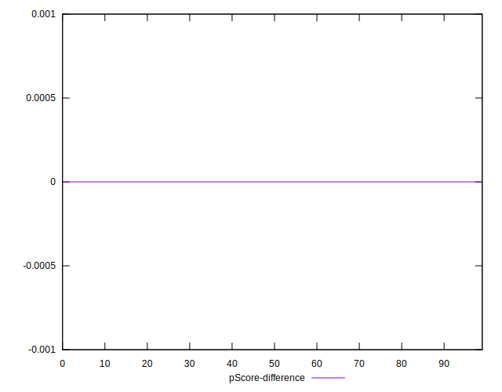

# //bootup-time/samples/pages

[→ Parent](../..)


## Raw


```yaml
p90min: 564.3840000000002
p90max: 616.6800000000002
p90range: 52.295999999999935
p90mean: 589.8643956043962
p90median: 588.5440000000006
p90stdev: 11.729172048460972
p90skewness: 0.20714620432366251
p90eccentricity: 1.0000000000000002
p90discretization: 1
outlandishness: 1.0068400886609854
confidence: 9.982367116648675
p90confidence: 4.819752610923388

```


## Score


```yaml
p90min: 0.9866327244510469
p90max: 0.9900557737175536
p90range: 0.003423049266506717
p90mean: 0.9884453027069132
p90median: 0.9885458223746785
p90stdev: 0.0007692721468986953
p90skewness: -0.2882406054667679
p90eccentricity: 1.0000000000000007
p90discretization: 1
outlandishness: 0.9996249646009105
confidence: 0.0007529985682739326
p90confidence: 0.00031610939145632067

```


## Raw Estimate


## Score Estimate


## P Score


```yaml
p90min: 0.9866327244510469
p90max: 0.9900557737175536
p90range: 0.003423049266506717
p90mean: 0.9884453027069132
p90median: 0.9885458223746785
p90stdev: 0.0007692721468986953
p90skewness: -0.2882406054667679
p90eccentricity: 1.0000000000000007
p90discretization: 1
outlandishness: 0.9996249646009105
confidence: 0.0007529985682739326
p90confidence: 0.00031610939145632067

```


## Score Difference


```yaml
p90min: -0.00012805717327113442
p90max: 0.0029668147952616186
p90range: 0.003094871968532753
p90mean: 0.0014512375018541
p90median: 0.0014138959667202577
p90stdev: 0.0007458099383051268
p90skewness: 0.05913363655199702
p90eccentricity: 1
p90discretization: 1
outlandishness: 0.9846629697902473
confidence: 0.00036294942917023494
p90confidence: 0.000306468298235117

```


## P Score Difference


```yaml
p90min: 0
p90max: 0
p90range: 0
p90mean: 0
p90median: 0
p90stdev: 0
p90skewness: .nan
p90eccentricity: .nan
p90discretization: 91
outlandishness: .nan
confidence: 0
p90confidence: 0

```

