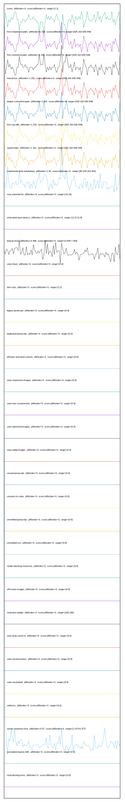

# //correlation/empty

[→ Parent](../..)

[0. score, p90stdev=0, score:p90stdev=0, range=[1:1]](../../meta/score/samples/empty)  
[1. first-meaningful-paint, p90stdev=1.332, score:p90stdev=0, range=[625.162:636.549]](../../first-meaningful-paint/samples/empty/)  
[2. first-contentful-paint, p90stdev=1.332, score:p90stdev=0, range=[625.162:636.549]](../../first-contentful-paint/samples/empty/)  
[3. interactive, p90stdev=1.332, score:p90stdev=0, range=[625.162:636.549]](../../interactive/samples/empty/)  
[4. largest-contentful-paint, p90stdev=1.332, score:p90stdev=0, range=[625.162:636.549]](../../largest-contentful-paint/samples/empty/)  
[5. first-cpu-idle, p90stdev=1.332, score:p90stdev=0, range=[625.162:636.549]](../../first-cpu-idle/samples/empty/)  
[6. speed-index, p90stdev=1.332, score:p90stdev=0, range=[625.162:636.549]](../../speed-index/samples/empty/)  
[7. mainthread-work-breakdown, p90stdev=1.92, score:p90stdev=0, range=[80.164:102.924]](../../mainthread-work-breakdown/samples/empty/)  
[8. max-potential-fid, p90stdev=0, score:p90stdev=0, range=[16:16]](../../max-potential-fid/samples/empty/)  
[9. estimated-input-latency, p90stdev=0, score:p90stdev=0, range=[12.8:12.8]](../../estimated-input-latency/samples/empty/)  
[10. bootup-time, p90stdev=0.358, score:p90stdev=0, range=[4.844:7.452]](../../bootup-time/samples/empty/)  
[11. uses-passive-event-listeners, p90stdev=NaN, score:p90stdev=0, range=[NaN:NaN]](../../uses-passive-event-listeners/samples/empty/)  
[12. uses-http2, p90stdev=0, score:p90stdev=0, range=[0:0]](../../uses-http2/samples/empty/)  
[13. no-document-write, p90stdev=NaN, score:p90stdev=0, range=[NaN:NaN]](../../no-document-write/samples/empty/)  
[14. dom-size, p90stdev=0, score:p90stdev=0, range=[2:2]](../../dom-size/samples/empty/)  
[15. legacy-javascript, p90stdev=0, score:p90stdev=0, range=[0:0]](../../legacy-javascript/samples/empty/)  
[16. duplicated-javascript, p90stdev=0, score:p90stdev=0, range=[0:0]](../../duplicated-javascript/samples/empty/)  
[17. efficient-animated-content, p90stdev=0, score:p90stdev=0, range=[0:0]](../../efficient-animated-content/samples/empty/)  
[18. uses-responsive-images, p90stdev=0, score:p90stdev=0, range=[0:0]](../../uses-responsive-images/samples/empty/)  
[19. uses-text-compression, p90stdev=0, score:p90stdev=0, range=[0:0]](../../uses-text-compression/samples/empty/)  
[20. uses-optimized-images, p90stdev=0, score:p90stdev=0, range=[0:0]](../../uses-optimized-images/samples/empty/)  
[21. uses-webp-images, p90stdev=0, score:p90stdev=0, range=[0:0]](../../uses-webp-images/samples/empty/)  
[22. unused-javascript, p90stdev=0, score:p90stdev=0, range=[0:0]](../../unused-javascript/samples/empty/)  
[23. unused-css-rules, p90stdev=0, score:p90stdev=0, range=[0:0]](../../unused-css-rules/samples/empty/)  
[24. unminified-javascript, p90stdev=0, score:p90stdev=0, range=[0:0]](../../unminified-javascript/samples/empty/)  
[25. unminified-css, p90stdev=0, score:p90stdev=0, range=[0:0]](../../unminified-css/samples/empty/)  
[26. render-blocking-resources, p90stdev=0, score:p90stdev=0, range=[0:0]](../../render-blocking-resources/samples/empty/)  
[27. offscreen-images, p90stdev=0, score:p90stdev=0, range=[0:0]](../../offscreen-images/samples/empty/)  
[28. total-byte-weight, p90stdev=0, score:p90stdev=0, range=[292:292]](../../total-byte-weight/samples/empty/)  
[29. uses-long-cache-ttl, p90stdev=0, score:p90stdev=0, range=[0:0]](../../uses-long-cache-ttl/samples/empty/)  
[30. font-display, p90stdev=NaN, score:p90stdev=0, range=[NaN:NaN]](../../font-display/samples/empty/)  
[31. uses-rel-preconnect, p90stdev=0, score:p90stdev=0, range=[0:0]](../../uses-rel-preconnect/samples/empty/)  
[32. uses-rel-preload, p90stdev=0, score:p90stdev=0, range=[0:0]](../../uses-rel-preload/samples/empty/)  
[33. redirects, p90stdev=0, score:p90stdev=0, range=[0:0]](../../redirects/samples/empty/)  
[34. server-response-time, p90stdev=0.07, score:p90stdev=0, range=[1.074:8.377]](../../server-response-time/samples/empty/)  
[35. cumulative-layout-shift, p90stdev=0, score:p90stdev=0, range=[0:0]](../../cumulative-layout-shift/samples/empty/)  
[36. total-blocking-time, p90stdev=0, score:p90stdev=0, range=[0:0]](../../total-blocking-time/samples/empty/)  
