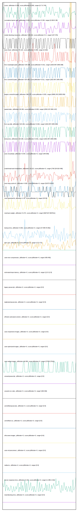

# //correlation/pages+cached+noadtech

[→ Parent](../..)

[0. score, p90stdev=0.009, score:p90stdev=0.009, range=[0.7:0.743]](../../meta/score/samples/pages+cached+noadtech)  
[1. cumulative-layout-shift, p90stdev=0.063, score:p90stdev=0.156, range=[0.064:0.38]](../../cumulative-layout-shift/samples/pages+cached+noadtech/)  
[2. render-blocking-resources, p90stdev=146.619, score:p90stdev=0.1, range=[157:476]](../../render-blocking-resources/samples/pages+cached+noadtech/)  
[3. uses-http2, p90stdev=70.125, score:p90stdev=0.058, range=[0:320]](../../uses-http2/samples/pages+cached+noadtech/)  
[4. first-meaningful-paint, p90stdev=104.296, score:p90stdev=0.011, range=[1815.857:2055.008]](../../first-meaningful-paint/samples/pages+cached+noadtech/)  
[5. first-contentful-paint, p90stdev=104.296, score:p90stdev=0.011, range=[1815.857:2055.008]](../../first-contentful-paint/samples/pages+cached+noadtech/)  
[6. largest-contentful-paint, p90stdev=386.175, score:p90stdev=0.003, range=[8908.245:23055.954]](../../largest-contentful-paint/samples/pages+cached+noadtech/)  
[7. speed-index, p90stdev=49.189, score:p90stdev=0.003, range=[2529.197:2691.167]](../../speed-index/samples/pages+cached+noadtech/)  
[8. first-cpu-idle, p90stdev=104.296, score:p90stdev=0.002, range=[1815.857:2055.008]](../../first-cpu-idle/samples/pages+cached+noadtech/)  
[9. interactive, p90stdev=104.296, score:p90stdev=0.001, range=[1815.857:2055.008]](../../interactive/samples/pages+cached+noadtech/)  
[10. uses-rel-preload, p90stdev=0.534, score:p90stdev=0, range=[454:606]](../../uses-rel-preload/samples/pages+cached+noadtech/)  
[11. mainthread-work-breakdown, p90stdev=19.123, score:p90stdev=0, range=[746.524:924.496]](../../mainthread-work-breakdown/samples/pages+cached+noadtech/)  
[12. uses-long-cache-ttl, p90stdev=4.928, score:p90stdev=0, range=[51073:51097]](../../uses-long-cache-ttl/samples/pages+cached+noadtech/)  
[13. max-potential-fid, p90stdev=2.45, score:p90stdev=0, range=[25:35]](../../max-potential-fid/samples/pages+cached+noadtech/)  
[14. total-byte-weight, p90stdev=9.273, score:p90stdev=0, range=[6827167:6837611]](../../total-byte-weight/samples/pages+cached+noadtech/)  
[15. bootup-time, p90stdev=0.653, score:p90stdev=0, range=[37.848:44.852]](../../bootup-time/samples/pages+cached+noadtech/)  
[16. dom-size, p90stdev=0, score:p90stdev=0, range=[172:172]](../../dom-size/samples/pages+cached+noadtech/)  
[17. uses-text-compression, p90stdev=0, score:p90stdev=0, range=[450:450]](../../uses-text-compression/samples/pages+cached+noadtech/)  
[18. estimated-input-latency, p90stdev=0, score:p90stdev=0, range=[12.8:12.8]](../../estimated-input-latency/samples/pages+cached+noadtech/)  
[19. uses-passive-event-listeners, p90stdev=NaN, score:p90stdev=0, range=[NaN:NaN]](../../uses-passive-event-listeners/samples/pages+cached+noadtech/)  
[20. no-document-write, p90stdev=NaN, score:p90stdev=0, range=[NaN:NaN]](../../no-document-write/samples/pages+cached+noadtech/)  
[21. legacy-javascript, p90stdev=0, score:p90stdev=0, range=[0:0]](../../legacy-javascript/samples/pages+cached+noadtech/)  
[22. duplicated-javascript, p90stdev=0, score:p90stdev=0, range=[0:0]](../../duplicated-javascript/samples/pages+cached+noadtech/)  
[23. efficient-animated-content, p90stdev=0, score:p90stdev=0, range=[0:0]](../../efficient-animated-content/samples/pages+cached+noadtech/)  
[24. uses-responsive-images, p90stdev=0, score:p90stdev=0, range=[0:0]](../../uses-responsive-images/samples/pages+cached+noadtech/)  
[25. uses-optimized-images, p90stdev=0, score:p90stdev=0, range=[0:0]](../../uses-optimized-images/samples/pages+cached+noadtech/)  
[26. uses-webp-images, p90stdev=66.099, score:p90stdev=0, range=[27450:27610]](../../uses-webp-images/samples/pages+cached+noadtech/)  
[27. unused-javascript, p90stdev=0, score:p90stdev=0, range=[0:0]](../../unused-javascript/samples/pages+cached+noadtech/)  
[28. unused-css-rules, p90stdev=0, score:p90stdev=0, range=[300:300]](../../unused-css-rules/samples/pages+cached+noadtech/)  
[29. unminified-javascript, p90stdev=0, score:p90stdev=0, range=[0:0]](../../unminified-javascript/samples/pages+cached+noadtech/)  
[30. unminified-css, p90stdev=0, score:p90stdev=0, range=[0:0]](../../unminified-css/samples/pages+cached+noadtech/)  
[31. offscreen-images, p90stdev=0, score:p90stdev=0, range=[0:0]](../../offscreen-images/samples/pages+cached+noadtech/)  
[32. unsized-images, p90stdev=NaN, score:p90stdev=0, range=[NaN:NaN]](../../unsized-images/samples/pages+cached+noadtech/)  
[33. third-party-summary, p90stdev=NaN, score:p90stdev=0, range=[NaN:NaN]](../../third-party-summary/samples/pages+cached+noadtech/)  
[34. font-display, p90stdev=NaN, score:p90stdev=0, range=[NaN:NaN]](../../font-display/samples/pages+cached+noadtech/)  
[35. uses-rel-preconnect, p90stdev=0, score:p90stdev=0, range=[0:0]](../../uses-rel-preconnect/samples/pages+cached+noadtech/)  
[36. redirects, p90stdev=0, score:p90stdev=0, range=[0:0]](../../redirects/samples/pages+cached+noadtech/)  
[37. server-response-time, p90stdev=0.194, score:p90stdev=0, range=[1.288:2.319]](../../server-response-time/samples/pages+cached+noadtech/)  
[38. total-blocking-time, p90stdev=0, score:p90stdev=0, range=[0:0]](../../total-blocking-time/samples/pages+cached+noadtech/)  
