# //cumulative-layout-shift/samples/pages+cached+noadtech

[→ Parent](../..)


## Raw


```yaml
p90min: 0.0938739013671875
p90max: 0.31750728607177736
p90range: 0.22363338470458988
p90mean: 0.1938007492023509
p90median: 0.1905707836151123
p90stdev: 0.06337796774429523
p90skewness: 0.3185075178125312
p90eccentricity: 0.9999999999999991
p90discretization: 15.166666666666666
outlandishness: 1.117689071596426
confidence: 0.029588619667028304
p90confidence: 0.026043281166692855

```

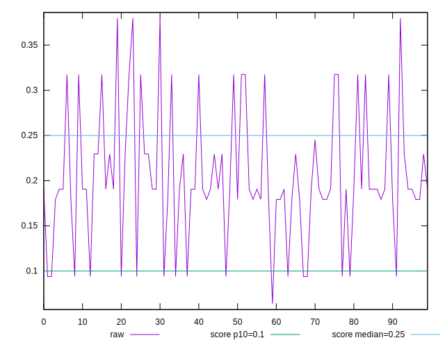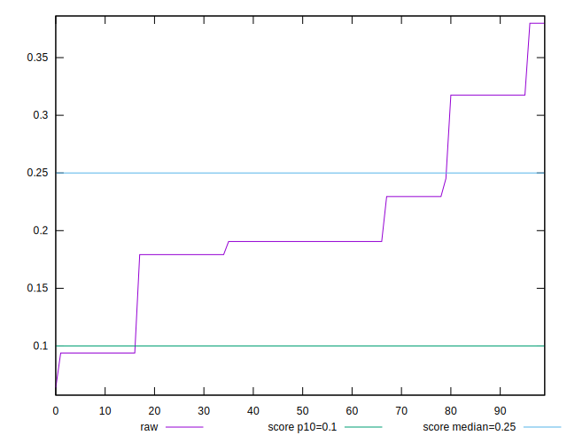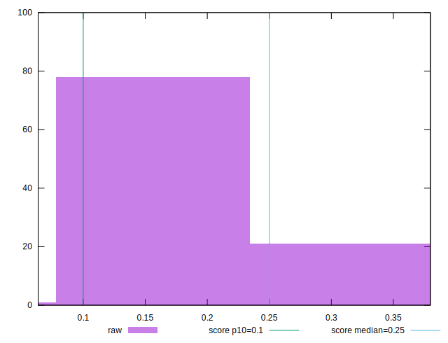
## Score


```yaml
p90min: 0.3690659991228524
p90max: 0.9146517814122077
p90range: 0.5455857822893553
p90mean: 0.6255045436600327
p90median: 0.6478936866255779
p90stdev: 0.15582084596889115
p90skewness: 0.04715454255351985
p90eccentricity: 1.0000000000000004
p90discretization: 15.166666666666666
outlandishness: 1.0037903778953063
confidence: 0.06949789900387482
p90confidence: 0.06402991840275685

```

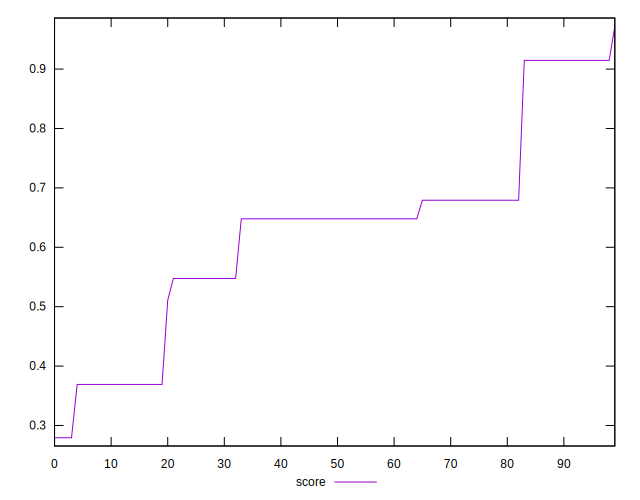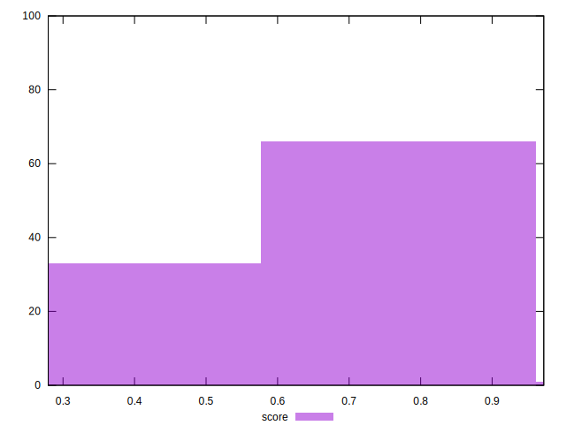
## Raw Estimate

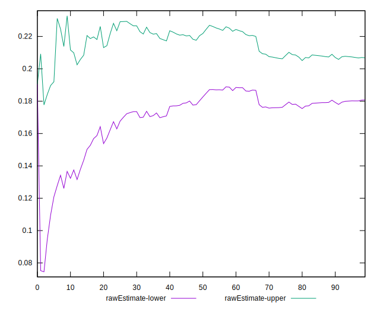
## Score Estimate

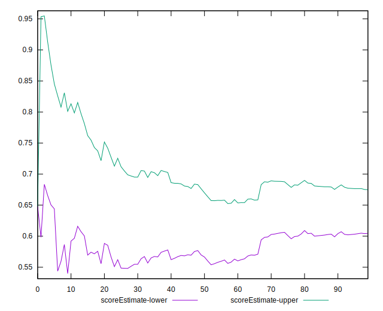
## P Score


```yaml
p90min: 0.3690659991228524
p90max: 0.9146517814122077
p90range: 0.5455857822893553
p90mean: 0.6255045436600327
p90median: 0.6478936866255779
p90stdev: 0.15582084596889115
p90skewness: 0.04715454255351985
p90eccentricity: 1.0000000000000004
p90discretization: 15.166666666666666
outlandishness: 1.0037903778953063
confidence: 0.06949789900387482
p90confidence: 0.06402991840275685

```

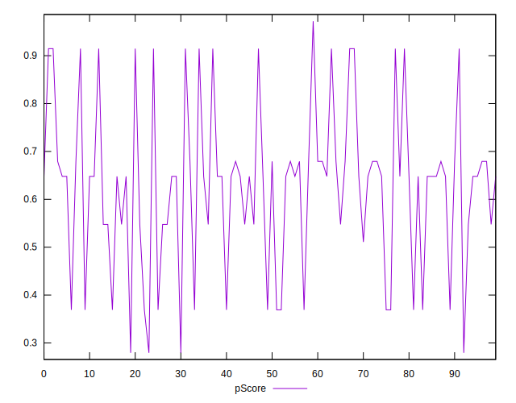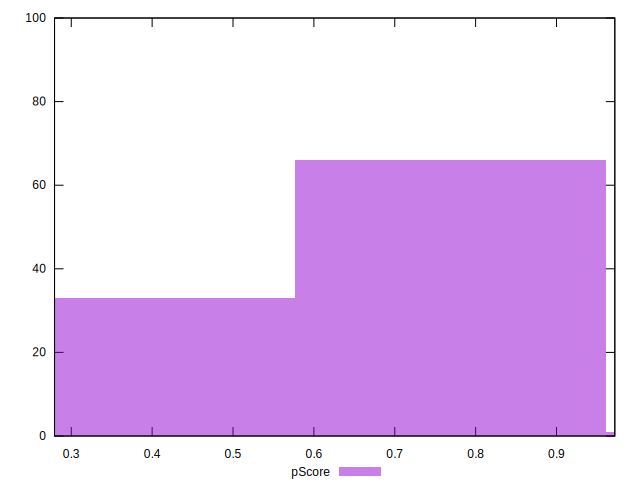
## Score Difference


```yaml
p90min: -0.004651781412207678
p90max: 0.0024545389728116707
p90range: 0.007106320385019349
p90mean: 0.0010217456819068978
p90median: 0.0009340008771476227
p90stdev: 0.001824008646065263
p90skewness: -2.2465020942062046
p90eccentricity: 1.0000000000000018
p90discretization: 11.375
outlandishness: 0.25025002926833795
confidence: 0.0009328974441302242
p90confidence: 0.0007495218245497041

```

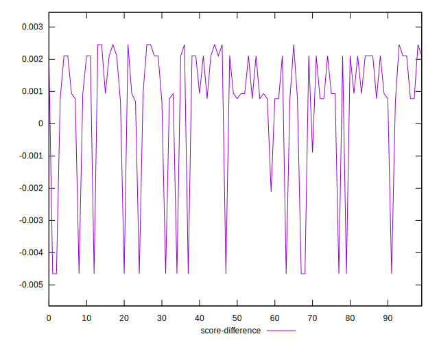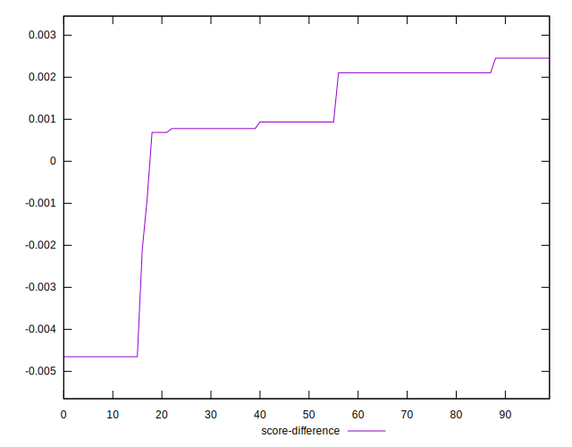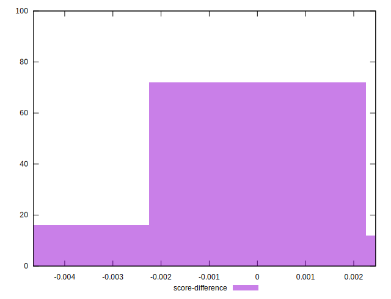
## P Score Difference


```yaml
p90min: 0
p90max: 0
p90range: 0
p90mean: 0
p90median: 0
p90stdev: 0
p90skewness: .nan
p90eccentricity: .nan
p90discretization: 91
outlandishness: .nan
confidence: 0
p90confidence: 0

```

