# //cumulative-layout-shift/samples/pages+cached+noexternal+nofonts+nosvg+noimg

[→ Parent](../..)


## Raw


```yaml
p90min: 0.0389404296875
p90max: 0.3188018798828125
p90range: 0.2798614501953125
p90mean: 0.19425067119109327
p90median: 0.19667434692382812
p90stdev: 0.06512058559986927
p90skewness: -0.6915666811612462
p90eccentricity: 0.9999999999999991
p90discretization: 11.375
outlandishness: 0.8612616485956838
confidence: 0.02994209366890027
p90confidence: 0.02675935787905953

```

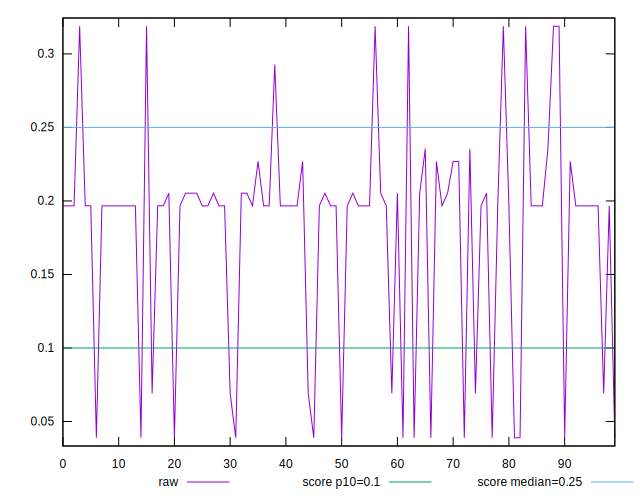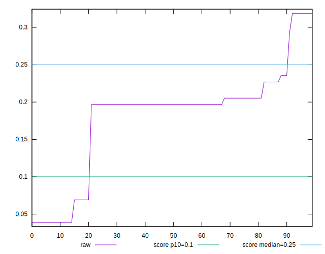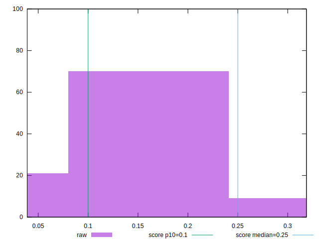
## Score


```yaml
p90min: 0.36692102630185863
p90max: 0.9953476174851198
p90range: 0.6284265911832612
p90mean: 0.6398186593879689
p90median: 0.6313938914065288
p90stdev: 0.15303034011333733
p90skewness: 0.8944110891868671
p90eccentricity: 1.0000000000000016
p90discretization: 11.375
outlandishness: 1.102521902947064
confidence: 0.06975144561240909
p90confidence: 0.06288324344330243

```

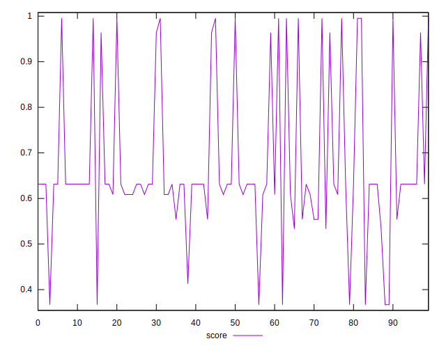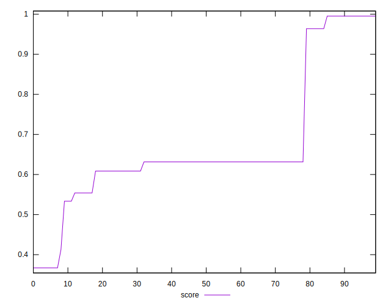
## Raw Estimate

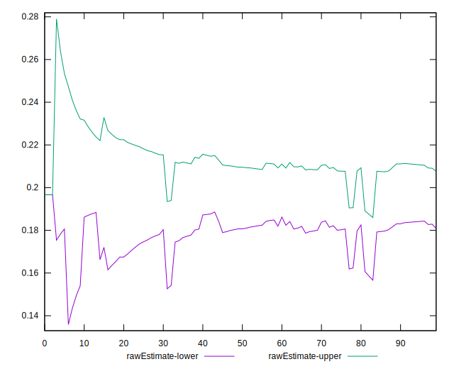
## Score Estimate

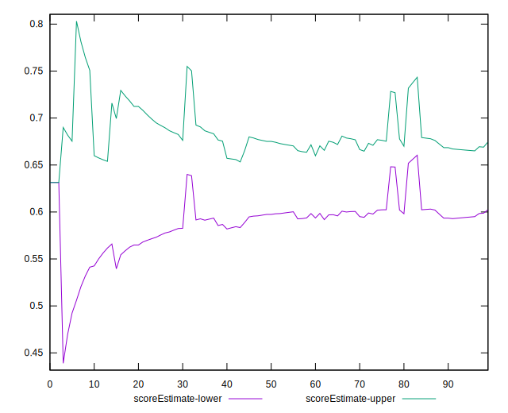
## P Score


```yaml
p90min: 0.36692102630185863
p90max: 0.9953476174851198
p90range: 0.6284265911832612
p90mean: 0.6398186593879689
p90median: 0.6313938914065288
p90stdev: 0.15303034011333733
p90skewness: 0.8944110891868671
p90eccentricity: 1.0000000000000016
p90discretization: 11.375
outlandishness: 1.102521902947064
confidence: 0.06975144561240909
p90confidence: 0.06288324344330243

```

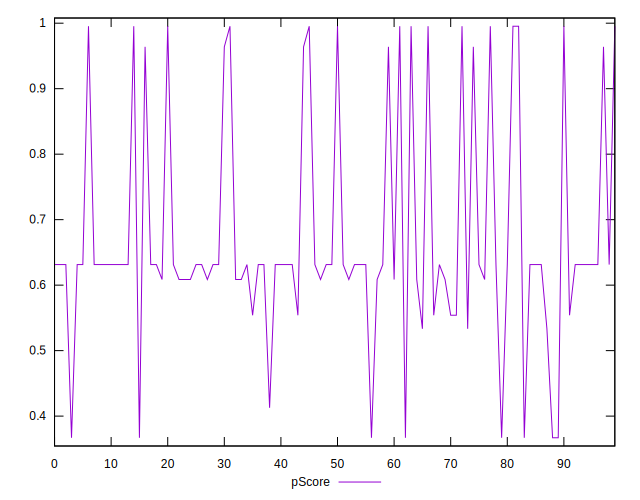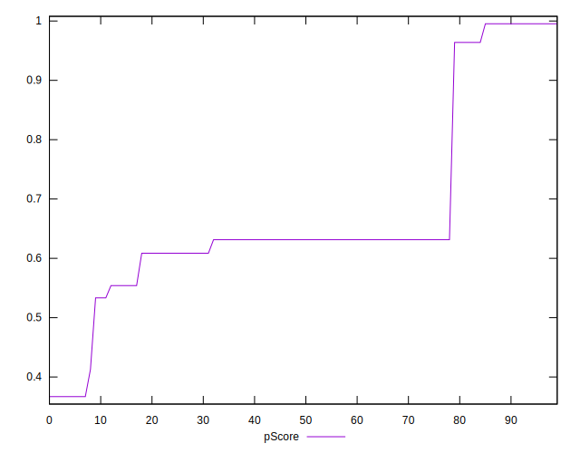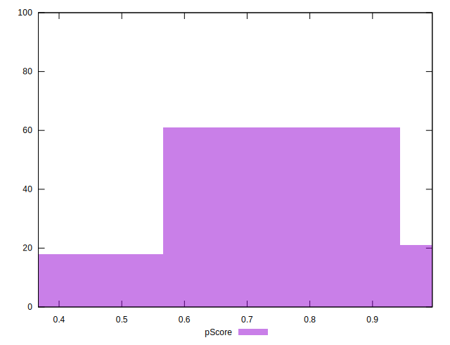
## Score Difference


```yaml
p90min: -0.0040004695589968
p90max: 0.0046523825148802045
p90range: 0.008652852073877004
p90mean: -0.000587890157198865
p90median: -0.001393891406528791
p90stdev: 0.002393678654064201
p90skewness: 0.6530559068310294
p90eccentricity: 0.9999999999999986
p90discretization: 11.375
outlandishness: 0.03911201772871232
confidence: 0.001070867802666869
p90confidence: 0.0009836106841105874

```

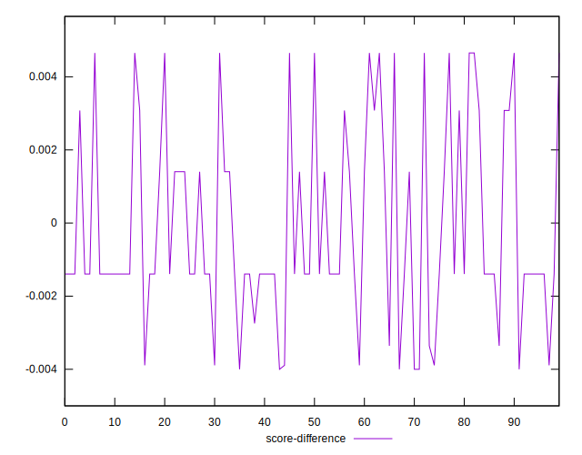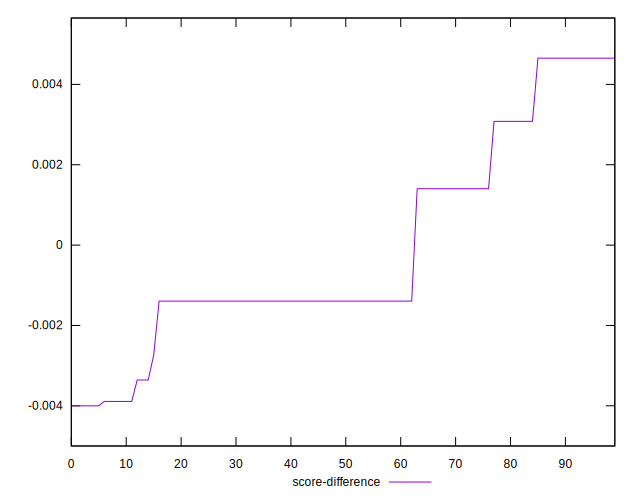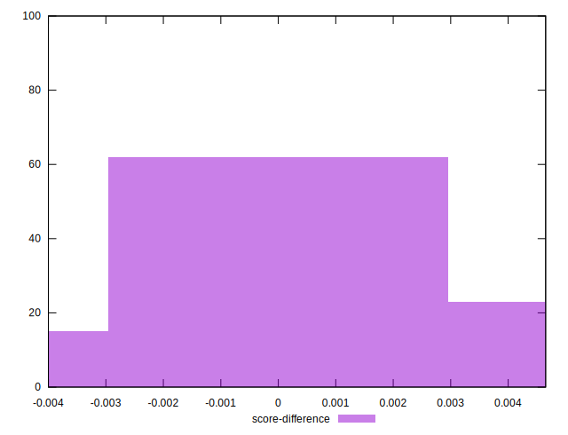
## P Score Difference


```yaml
p90min: 0
p90max: 0
p90range: 0
p90mean: 0
p90median: 0
p90stdev: 0
p90skewness: .nan
p90eccentricity: .nan
p90discretization: 91
outlandishness: .nan
confidence: 0
p90confidence: 0

```

