# //first-contentful-paint/samples/empty

[→ Parent](../..)


## Raw


```yaml
p90min: 625.20675
p90max: 631.29395
p90range: 6.087199999999939
p90mean: 628.121121978022
p90median: 628.20435
p90stdev: 1.3320611023920694
p90skewness: -0.08782431916081142
p90eccentricity: 1
p90discretization: 1
outlandishness: 1.0011125661661102
confidence: 0.8043109651684972
p90confidence: 0.5473706881984981

```

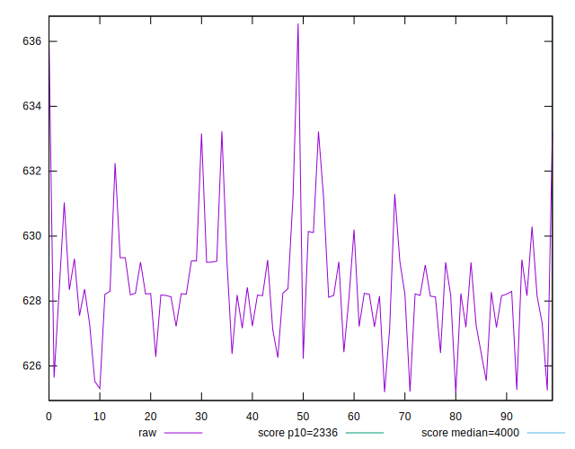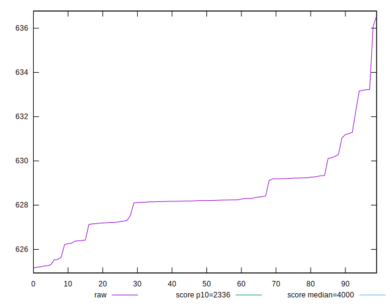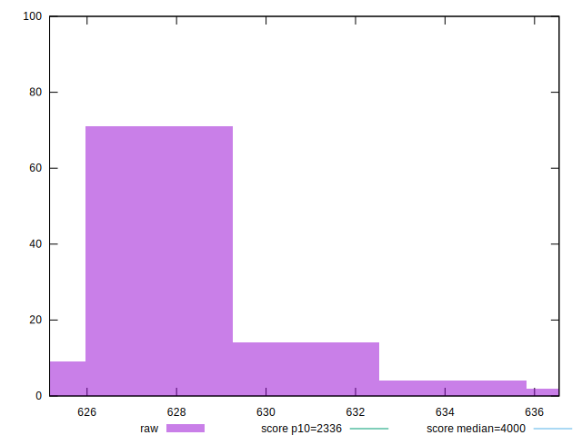
## Score


```yaml
p90min: 0.9999945617366611
p90max: 0.9999951116371366
p90range: 5.499004754883074e-7
p90mean: 0.9999948534667581
p90median: 0.9999948471703345
p90stdev: 1.199937484864743e-7
p90skewness: 0.01930954131719184
p90eccentricity: 0.9999999999999997
p90discretization: 1
outlandishness: 0.9999999334432339
confidence: 7.451655159584902e-8
p90confidence: 4.930784380796638e-8

```

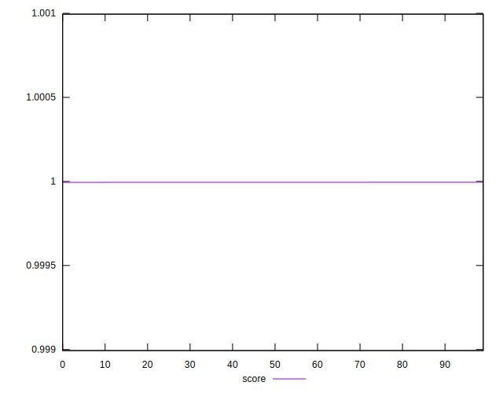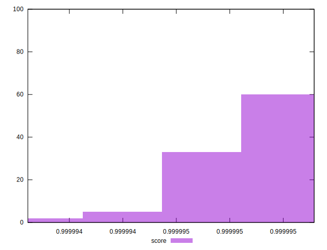
## Raw Estimate

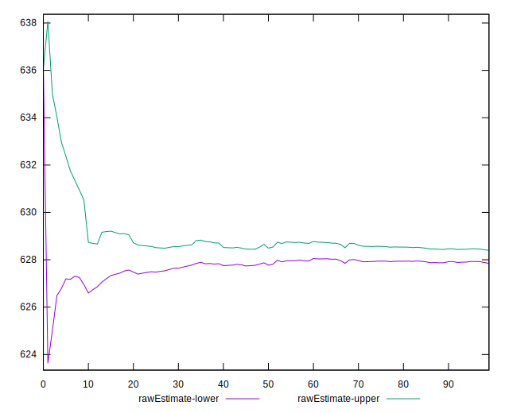
## Score Estimate

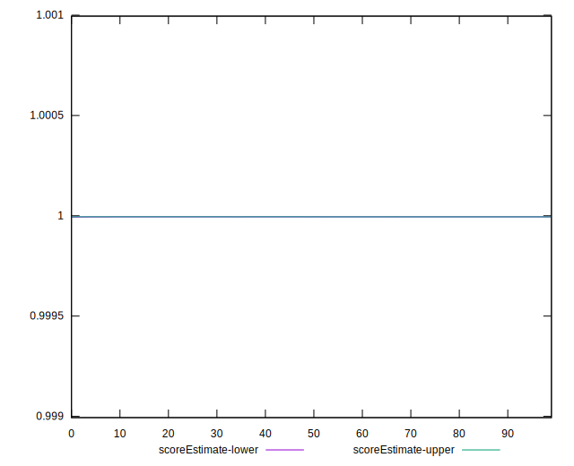
## P Score


```yaml
p90min: 0.9999945617366611
p90max: 0.9999951116371366
p90range: 5.499004754883074e-7
p90mean: 0.9999948534667581
p90median: 0.9999948471703345
p90stdev: 1.199937484864743e-7
p90skewness: 0.01930954131719184
p90eccentricity: 0.9999999999999997
p90discretization: 1
outlandishness: 0.9999999334432339
confidence: 7.451655159584902e-8
p90confidence: 4.930784380796638e-8

```

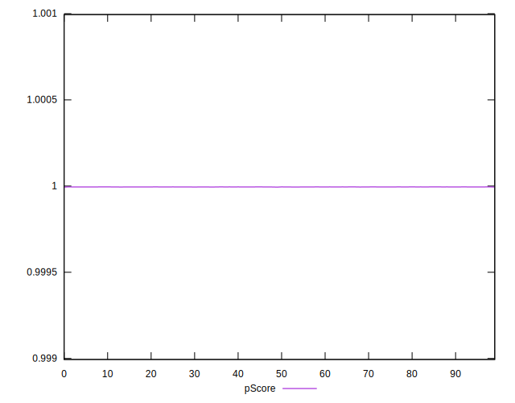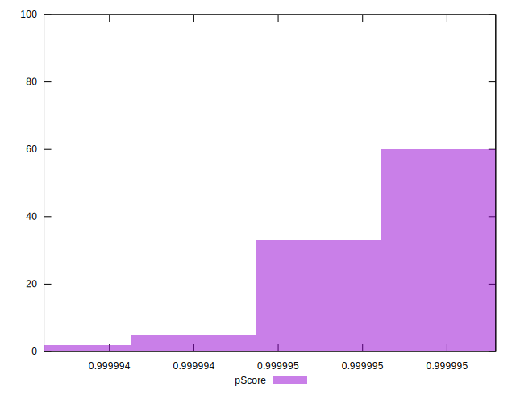
## Score Difference


```yaml
p90min: 0.000004888362863386675
p90max: 0.000005438263338874982
p90range: 5.499004754883074e-7
p90mean: 0.000005146533242054127
p90median: 0.000005152829665511227
p90stdev: 1.1999374848647426e-7
p90skewness: -0.019309553335076526
p90eccentricity: 1.0000000000000007
p90discretization: 1
outlandishness: 1.0129740940330278
confidence: 7.451655167412503e-8
p90confidence: 4.930784373975143e-8

```

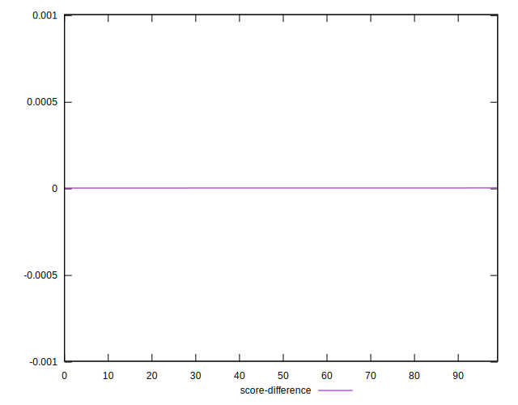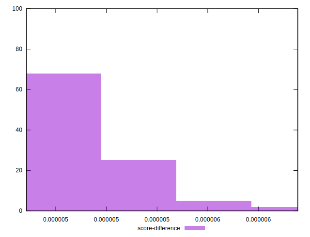
## P Score Difference


```yaml
p90min: 0
p90max: 0
p90range: 0
p90mean: 0
p90median: 0
p90stdev: 0
p90skewness: .nan
p90eccentricity: .nan
p90discretization: 91
outlandishness: .nan
confidence: 0
p90confidence: 0

```

