# //first-meaningful-paint/samples/pages+cached+nointeractive

[→ Parent](../..)


## Raw


```yaml
p90min: 1971.9841000000001
p90max: 2205.583
p90range: 233.59889999999996
p90mean: 2120.3966010989006
p90median: 2199.5329499999993
p90stdev: 101.37623183280772
p90skewness: -0.6512574334076272
p90eccentricity: 0.9999999999999999
p90discretization: 1
outlandishness: 0.9873123635409286
confidence: 41.472805769663864
p90confidence: 41.65753183967172

```

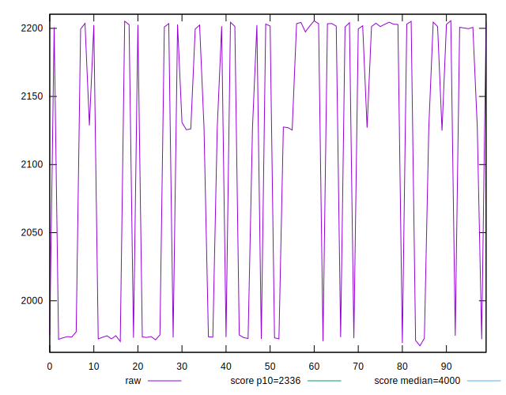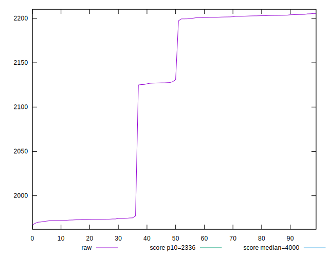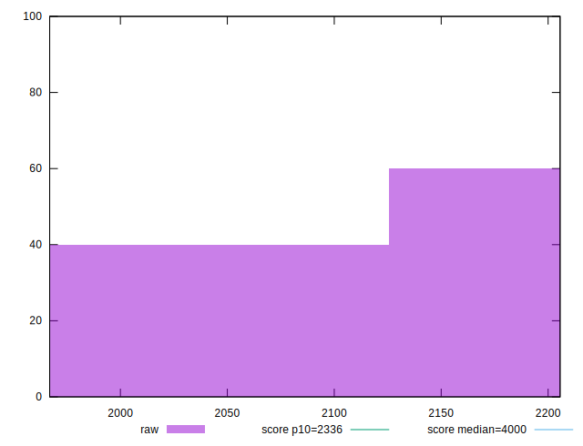
## Score


```yaml
p90min: 0.9219679058503829
p90max: 0.9540233491611516
p90range: 0.032055443310768705
p90mean: 0.9338653143918454
p90median: 0.9229183052395455
p90stdev: 0.013891544856384224
p90skewness: 0.6180732203195951
p90eccentricity: 0.9999999999999996
p90discretization: 1
outlandishness: 1.0039234106479396
confidence: 0.00567344778983947
p90confidence: 0.005708315072426862

```

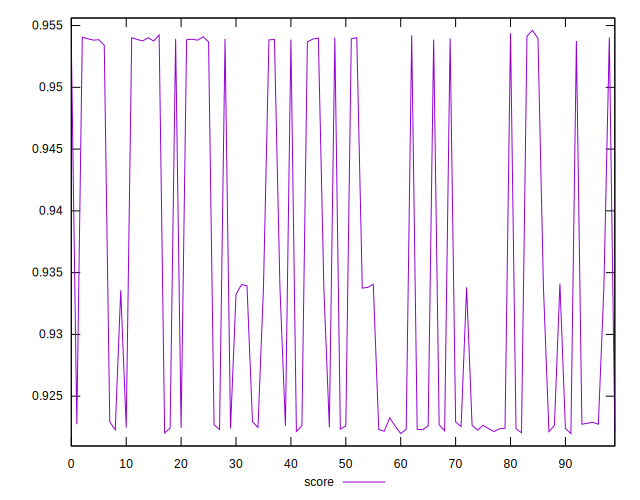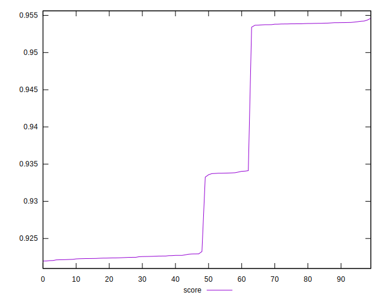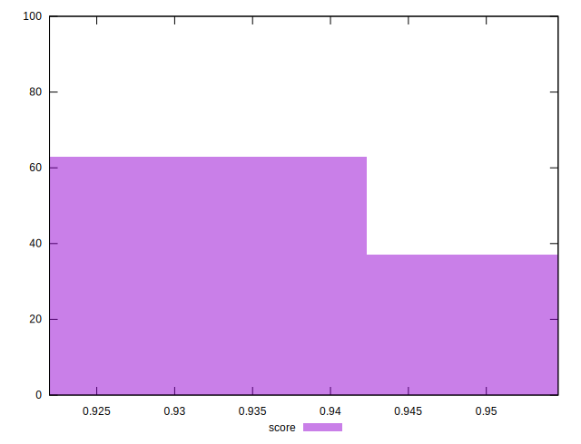
## Raw Estimate

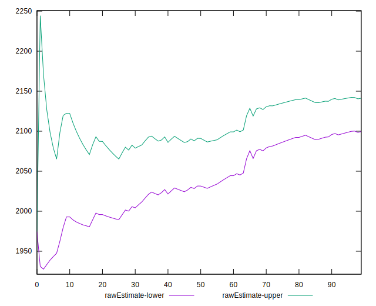
## Score Estimate

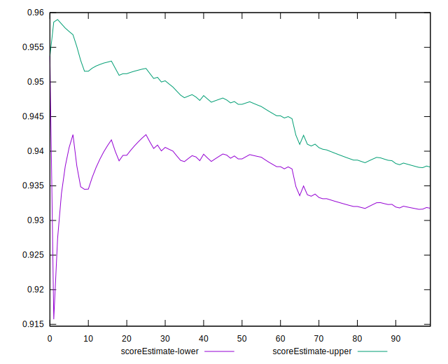
## P Score


```yaml
p90min: 0.9219679058503829
p90max: 0.9540233491611516
p90range: 0.032055443310768705
p90mean: 0.9338653143918454
p90median: 0.9229183052395455
p90stdev: 0.013891544856384224
p90skewness: 0.6180732203195951
p90eccentricity: 0.9999999999999996
p90discretization: 1
outlandishness: 1.0039234106479396
confidence: 0.00567344778983947
p90confidence: 0.005708315072426862

```

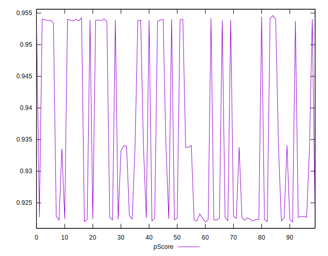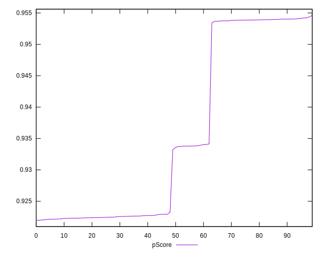
## Score Difference


```yaml
p90min: -0.004239090303619242
p90max: -0.0021626221605267615
p90range: 0.0020764681430924803
p90mean: -0.003254254699480382
p90median: -0.0036735485334287166
p90stdev: 0.0007029881748204441
p90skewness: 0.1982118337107
p90eccentricity: 1.0000000000000004
p90discretization: 1
outlandishness: 0.9642102168608111
confidence: 0.00029788772526023136
p90confidence: 0.00028887197468330066

```

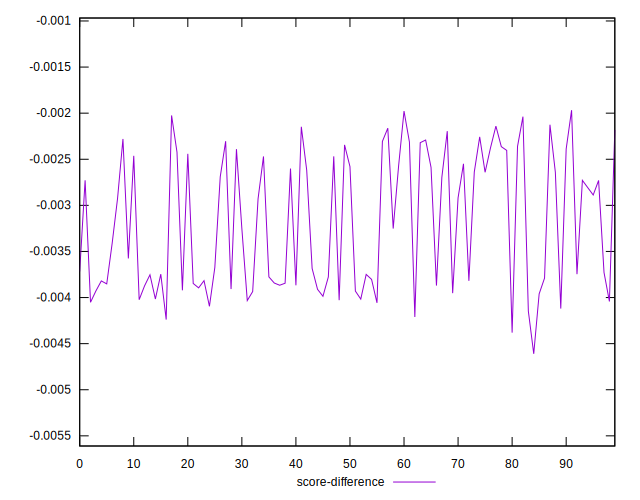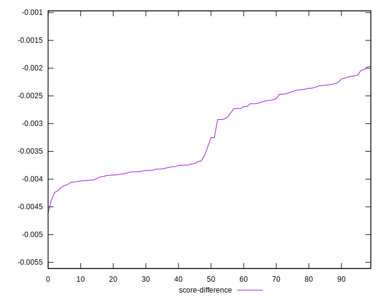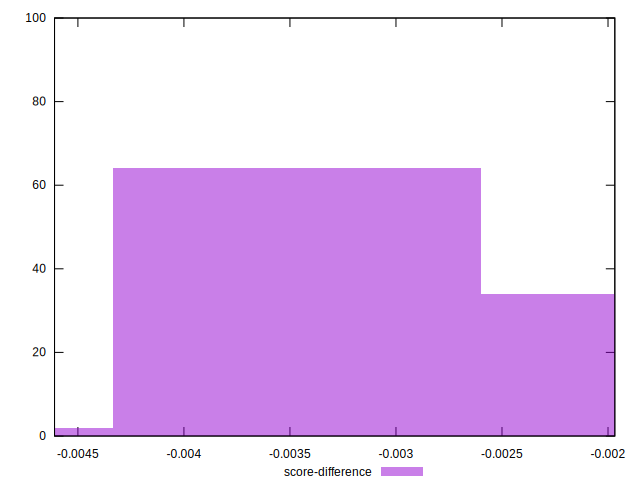
## P Score Difference


```yaml
p90min: 0
p90max: 0
p90range: 0
p90mean: 0
p90median: 0
p90stdev: 0
p90skewness: .nan
p90eccentricity: .nan
p90discretization: 91
outlandishness: .nan
confidence: 0
p90confidence: 0

```

