# //first-meaningful-paint/samples/pages+cached

[→ Parent](../..)


## Raw


```yaml
p90min: 1947.971
p90max: 2206.01295
p90range: 258.0419499999998
p90mean: 2015.8922027472534
p90median: 1974.5679000000002
p90stdev: 84.48461690953835
p90skewness: 1.5899526186708801
p90eccentricity: 0.9999999999999996
p90discretization: 1
outlandishness: 1.017141178554205
confidence: 38.18265412993151
p90confidence: 34.716427660044246

```

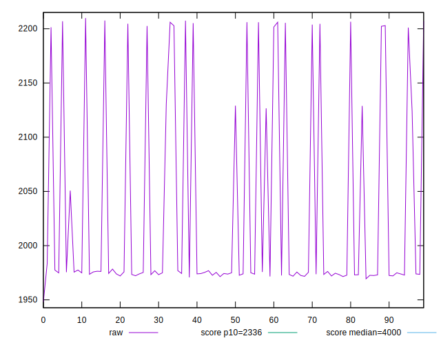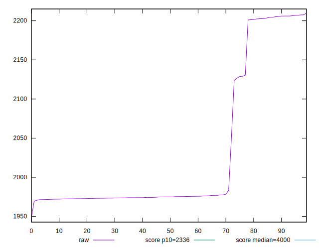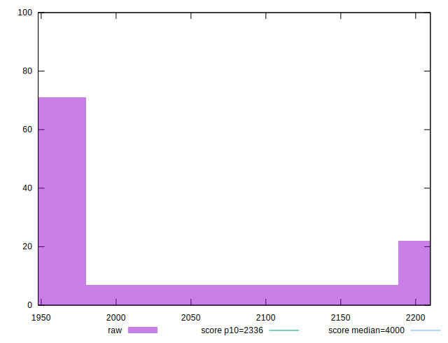
## Score


```yaml
p90min: 0.921900128133947
p90max: 0.9567701181098782
p90range: 0.03486998997593127
p90mean: 0.9481030400535285
p90median: 0.9537216793440335
p90stdev: 0.011511190228597859
p90skewness: -1.6167274732795778
p90eccentricity: 1.0000000000000004
p90discretization: 1
outlandishness: 0.9950005620610253
confidence: 0.005222776751893976
p90confidence: 0.004730179498594778

```

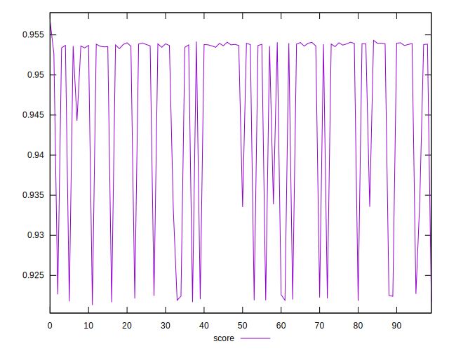
## Raw Estimate

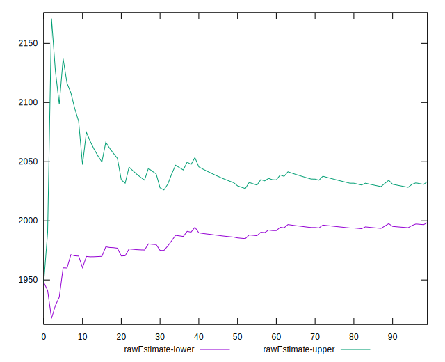
## Score Estimate

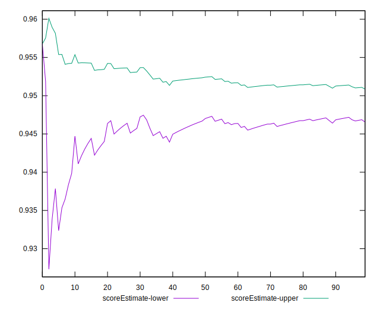
## P Score


```yaml
p90min: 0.921900128133947
p90max: 0.9567701181098782
p90range: 0.03486998997593127
p90mean: 0.9481030400535285
p90median: 0.9537216793440335
p90stdev: 0.011511190228597859
p90skewness: -1.6167274732795778
p90eccentricity: 1.0000000000000004
p90discretization: 1
outlandishness: 0.9950005620610253
confidence: 0.005222776751893976
p90confidence: 0.004730179498594778

```

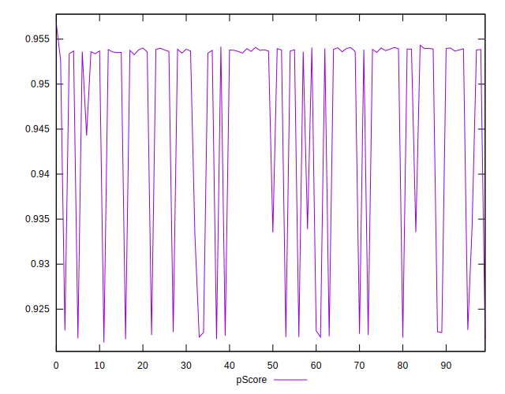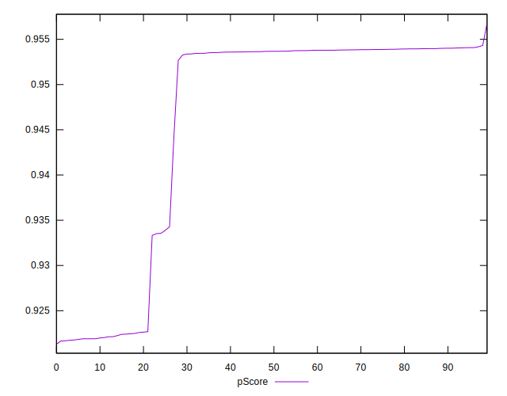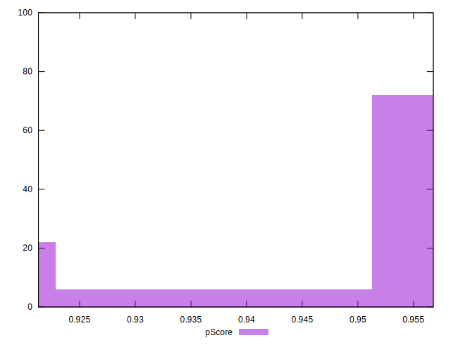
## Score Difference


```yaml
p90min: -0.004320475169218629
p90max: -0.0018987878692459104
p90range: 0.002421687299972719
p90mean: -0.0035440144464889576
p90median: -0.003749692028200635
p90stdev: 0.0005952434691209909
p90skewness: 1.4882320128957105
p90eccentricity: 0.9999999999999999
p90discretization: 1
outlandishness: 0.8829135626507244
confidence: 0.00039302120515674263
p90confidence: 0.00024459750889300157

```

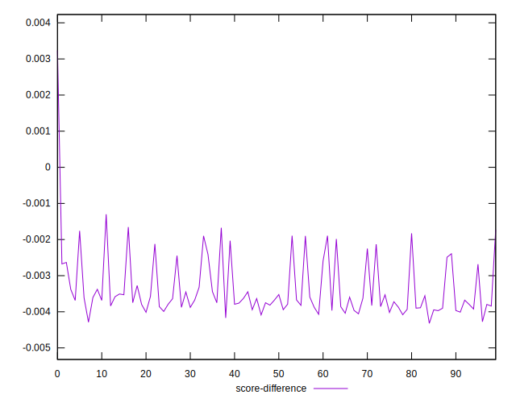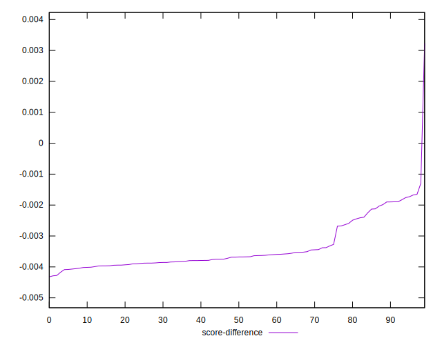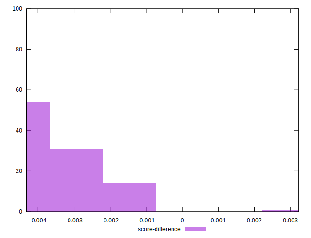
## P Score Difference


```yaml
p90min: 0
p90max: 0
p90range: 0
p90mean: 0
p90median: 0
p90stdev: 0
p90skewness: .nan
p90eccentricity: .nan
p90discretization: 91
outlandishness: .nan
confidence: 0
p90confidence: 0

```

