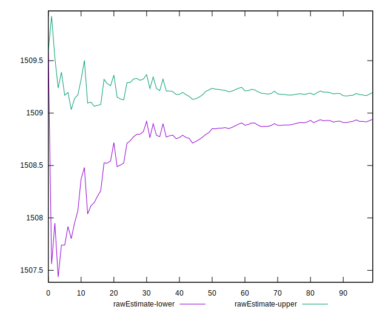

# //interactive/samples/pages+cached+noexternal+nofonts+nosvg+noimg+nocss+nojs

[→ Parent](../..)


## Raw


```yaml
p90min: 1507.6709999999998
p90max: 1510.3714
p90range: 2.7004000000001724
p90mean: 1509.0685252747253
p90median: 1509.1147999999998
p90stdev: 0.6229805780038024
p90skewness: -0.28001023305962347
p90eccentricity: 0.9999999999999997
p90discretization: 1.011111111111111
outlandishness: 0.9998261926829626
confidence: 0.30867238888367865
p90confidence: 0.2559952445903946

```


## Score


```yaml
p90min: 0.9989439803807029
p90max: 0.9989562727653929
p90range: 0.000012292384690026914
p90mean: 0.998949921952762
p90median: 0.99894971418604
p90stdev: 0.0000028354696948098353
p90skewness: 0.2755873599938137
p90eccentricity: 1.0000000000000002
p90discretization: 1.011111111111111
outlandishness: 1.0000011916809994
confidence: 0.000001403674328326332
p90confidence: 0.000001165151505055917

```


## Raw Estimate


## Score Estimate


## P Score


```yaml
p90min: 0.9989439803807029
p90max: 0.9989562727653929
p90range: 0.000012292384690026914
p90mean: 0.998949921952762
p90median: 0.99894971418604
p90stdev: 0.0000028354696948098353
p90skewness: 0.2755873599938137
p90eccentricity: 1.0000000000000002
p90discretization: 1.011111111111111
outlandishness: 1.0000011916809994
confidence: 0.000001403674328326332
p90confidence: 0.000001165151505055917

```


## Score Difference


```yaml
p90min: 0.0010437272346071058
p90max: 0.0010560196192971327
p90range: 0.000012292384690026914
p90mean: 0.0010500780472380866
p90median: 0.0010502858139600502
p90stdev: 0.000002835469694809836
p90skewness: -0.27558736043659926
p90eccentricity: 0.9999999999999992
p90discretization: 1.011111111111111
outlandishness: 0.998866663383457
confidence: 0.0000014036743282929386
p90confidence: 0.0000011651515050073447

```


## P Score Difference


```yaml
p90min: 0
p90max: 0
p90range: 0
p90mean: 0
p90median: 0
p90stdev: 0
p90skewness: .nan
p90eccentricity: .nan
p90discretization: 91
outlandishness: .nan
confidence: 0
p90confidence: 0

```

