# //interactive/samples/pages+cached+noexternal+noimg

[→ Parent](../..)


## Raw


```yaml
p90min: 1816.7107999999996
p90max: 2050.66715
p90range: 233.9563500000006
p90mean: 1968.702523626373
p90median: 2043.8113499999997
p90stdev: 98.96706850308051
p90skewness: -0.7407006475096194
p90eccentricity: 0.9999999999999997
p90discretization: 1
outlandishness: 0.9860374378698534
confidence: 40.80576058579845
p90confidence: 40.6675581910099

```

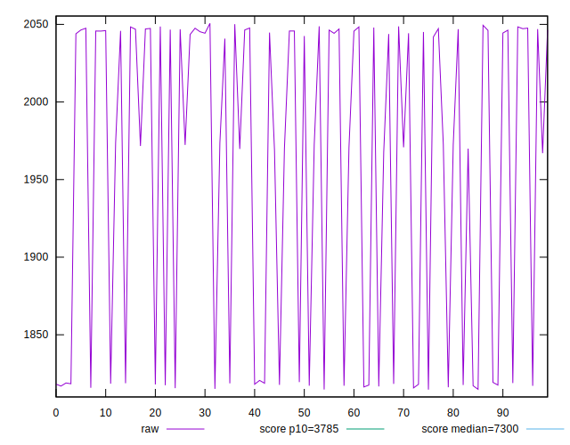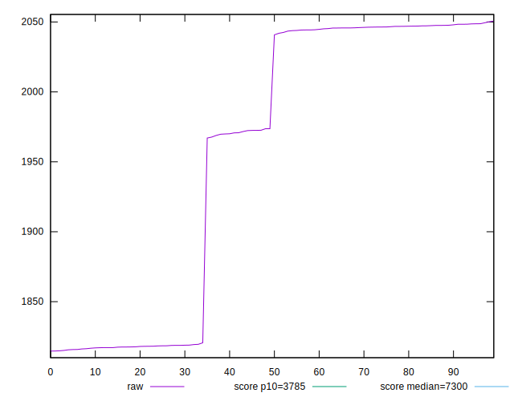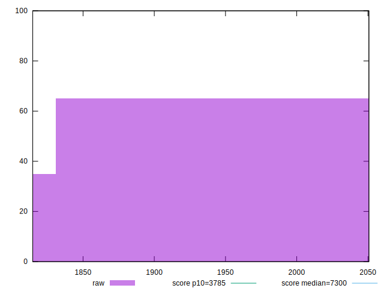
## Score


```yaml
p90min: 0.9933819951670377
p90max: 0.996673227344125
p90range: 0.0032912321770872666
p90mean: 0.9945747891875941
p90median: 0.9935021856178052
p90stdev: 0.001388599497205585
p90skewness: 0.6781448209757944
p90eccentricity: 0.9999999999999999
p90discretization: 1
outlandishness: 1.000382264484048
confidence: 0.0005707475879683788
p90confidence: 0.0005706034513375258

```

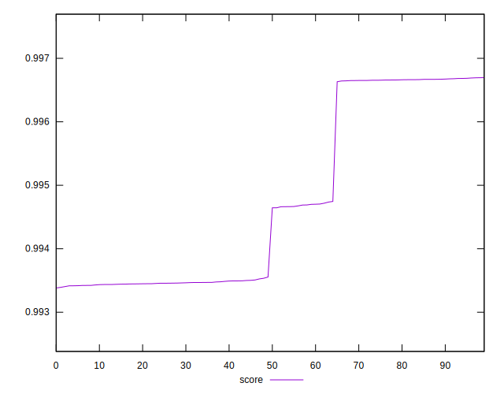
## Raw Estimate


## Score Estimate

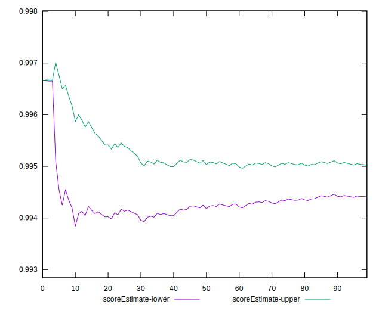
## P Score


```yaml
p90min: 0.9933819951670377
p90max: 0.996673227344125
p90range: 0.0032912321770872666
p90mean: 0.9945747891875941
p90median: 0.9935021856178052
p90stdev: 0.001388599497205585
p90skewness: 0.6781448209757944
p90eccentricity: 0.9999999999999999
p90discretization: 1
outlandishness: 1.000382264484048
confidence: 0.0005707475879683788
p90confidence: 0.0005706034513375258

```

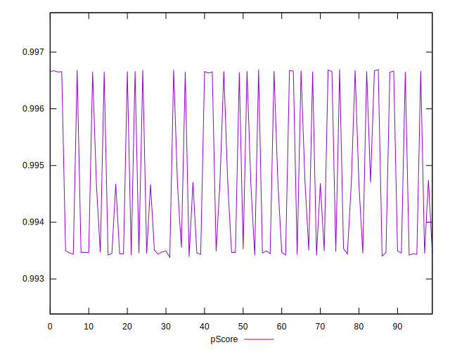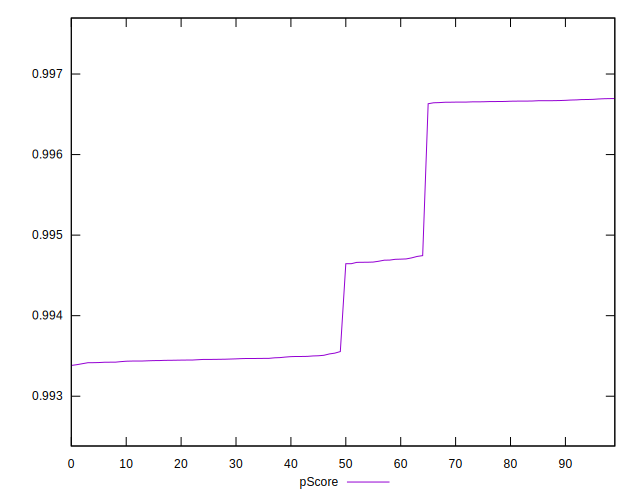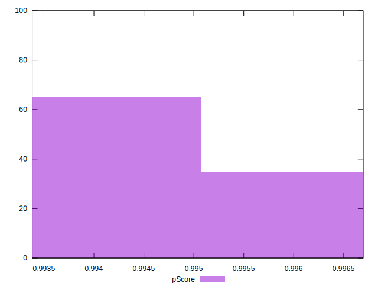
## Score Difference


```yaml
p90min: -0.004745525868135703
p90max: 0.00334544562003225
p90range: 0.008090971488167953
p90mean: -0.001721539137606556
p90median: -0.0034469798809607655
p90stdev: 0.0032238281402470793
p90skewness: 0.8839305984685585
p90eccentricity: 0.9999999999999993
p90discretization: 1
outlandishness: 0.5398280731504141
confidence: 0.001333142573365211
p90confidence: 0.0013247357982239596

```

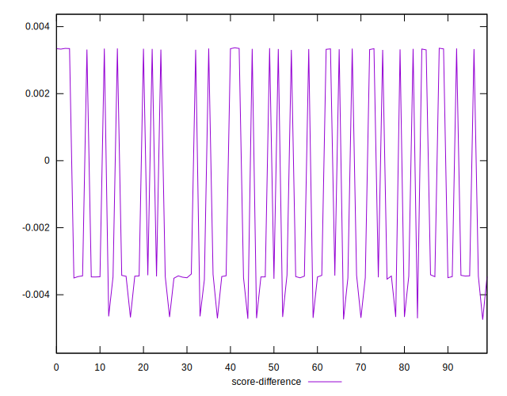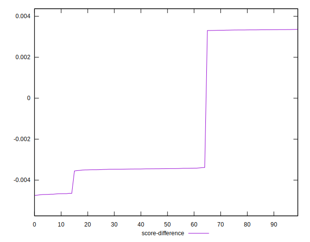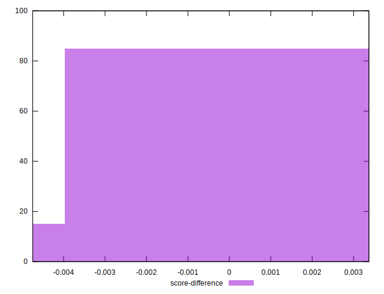
## P Score Difference


```yaml
p90min: 0
p90max: 0
p90range: 0
p90mean: 0
p90median: 0
p90stdev: 0
p90skewness: .nan
p90eccentricity: .nan
p90discretization: 91
outlandishness: .nan
confidence: 0
p90confidence: 0

```

