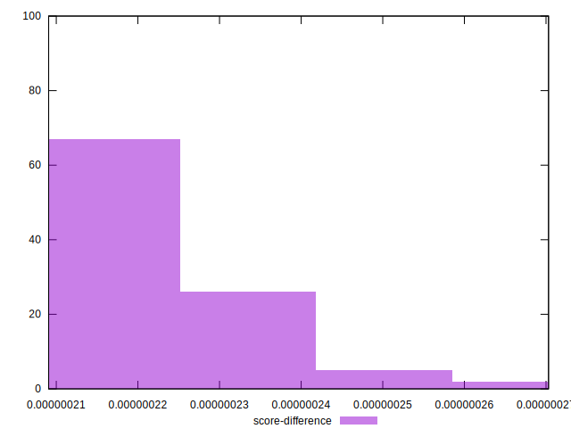

# //largest-contentful-paint/samples/empty

[→ Parent](../..)


## Raw


```yaml
p90min: 625.20675
p90max: 631.29395
p90range: 6.087199999999939
p90mean: 628.121121978022
p90median: 628.20435
p90stdev: 1.3320611023920694
p90skewness: -0.08782431916081142
p90eccentricity: 1
p90discretization: 1
outlandishness: 1.0011125661661102
confidence: 0.8043109651684972
p90confidence: 0.5473706881984981

```


## Score


```yaml
p90min: 0.9999997597054378
p90max: 0.9999997907205245
p90range: 3.101508672109787e-8
p90mean: 0.9999997762577918
p90median: 0.9999997759262111
p90stdev: 6.7611830946677495e-9
p90skewness: -0.00429263430343963
p90eccentricity: 0.9999999999999986
p90discretization: 1
outlandishness: 0.9999999961774302
confidence: 4.2409200595727725e-9
p90confidence: 2.7783060296826534e-9

```


## Raw Estimate


## Score Estimate


## P Score


```yaml
p90min: 0.9999997597054378
p90max: 0.9999997907205245
p90range: 3.101508672109787e-8
p90mean: 0.9999997762577918
p90median: 0.9999997759262111
p90stdev: 6.7611830946677495e-9
p90skewness: -0.00429263430343963
p90eccentricity: 0.9999999999999986
p90discretization: 1
outlandishness: 0.9999999961774302
confidence: 4.2409200595727725e-9
p90confidence: 2.7783060296826534e-9

```


## Score Difference


```yaml
p90min: 2.0927947552706883e-7
p90max: 2.402945622481667e-7
p90range: 3.101508672109787e-8
p90mean: 2.2374220818934175e-7
p90median: 2.2407378885702656e-7
p90stdev: 6.761183094667742e-9
p90skewness: 0.004292493555919188
p90eccentricity: 1.0000000000000002
p90discretization: 1
outlandishness: 1.0171576731763048
confidence: 4.240920074429572e-9
p90confidence: 2.778306067880716e-9

```


## P Score Difference


```yaml
p90min: 0
p90max: 0
p90range: 0
p90mean: 0
p90median: 0
p90stdev: 0
p90skewness: .nan
p90eccentricity: .nan
p90discretization: 91
outlandishness: .nan
confidence: 0
p90confidence: 0

```

