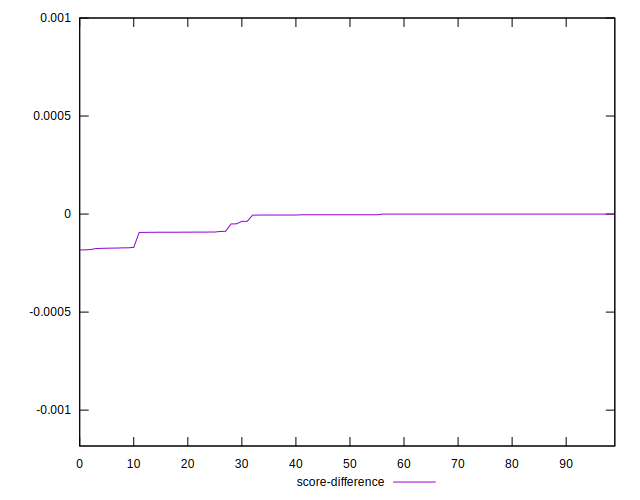

# //largest-contentful-paint/samples/pages+cached+nointeractive

[→ Parent](../..)


## Raw


```yaml
p90min: 14866.3947
p90max: 29531.422649999986
p90range: 14665.027949999985
p90mean: 23358.07997912088
p90median: 20746.24429999999
p90stdev: 5637.330297874539
p90skewness: -0.11269507804854832
p90eccentricity: 1.0000000000000004
p90discretization: 1.011111111111111
outlandishness: 0.9353540302833145
confidence: 2314.990187999232
p90confidence: 2316.49235850227

```


## Score


```yaml
p90min: 2.5091771993501766e-8
p90max: 0.00017208857163436564
p90range: 0.00017206347986237214
p90mean: 0.00002397690224228702
p90median: 0.0000035926838468092193
p90stdev: 0.00004168553284282022
p90skewness: 1.6616182367910788
p90eccentricity: 0.9999999999999999
p90discretization: 1.011111111111111
outlandishness: 2.475275683077843
confidence: 0.000023168144282938616
p90confidence: 0.00001712942353704134

```


## Raw Estimate


## Score Estimate


## P Score


```yaml
p90min: 2.5091771993501766e-8
p90max: 0.00017208857163436564
p90range: 0.00017206347986237214
p90mean: 0.00002397690224228702
p90median: 0.0000035926838468092193
p90stdev: 0.00004168553284282022
p90skewness: 1.6616182367910788
p90eccentricity: 0.9999999999999999
p90discretization: 1.011111111111111
outlandishness: 2.475275683077843
confidence: 0.000023168144282938616
p90confidence: 0.00001712942353704134

```


## Score Difference


```yaml
p90min: -0.00017208857163436564
p90max: -2.5091771993501766e-8
p90range: 0.00017206347986237214
p90mean: -0.00002397690224228702
p90median: -0.0000035926838468092193
p90stdev: 0.00004168553284282022
p90skewness: -1.6616182367910788
p90eccentricity: 0.9999999999999999
p90discretization: 1.011111111111111
outlandishness: 2.475275683077843
confidence: 0.000023168144282938616
p90confidence: 0.00001712942353704134

```


## P Score Difference


```yaml
p90min: 0
p90max: 0
p90range: 0
p90mean: 0
p90median: 0
p90stdev: 0
p90skewness: .nan
p90eccentricity: .nan
p90discretization: 91
outlandishness: .nan
confidence: 0
p90confidence: 0

```

