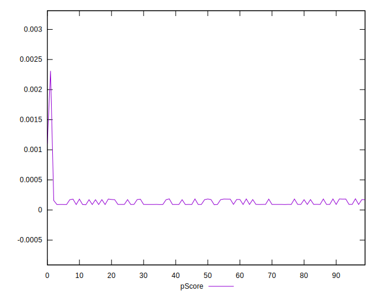

# //largest-contentful-paint/samples/pages+cached

[→ Parent](../..)


## Raw


```yaml
p90min: 14781.5129
p90max: 15844.007299999994
p90range: 1062.4943999999941
p90mean: 15434.950306593402
p90median: 15760.802200000002
p90stdev: 447.9746804005015
p90skewness: -0.5786337981697186
p90eccentricity: 1.0000000000000002
p90discretization: 1
outlandishness: 0.9846160621557554
confidence: 268.30341014819714
p90confidence: 184.08180275360428

```


## Score


```yaml
p90min: 0.00009058541282780386
p90max: 0.0001864052208437328
p90range: 0.00009581980801592893
p90mean: 0.00012923699830319734
p90median: 0.00009289123054062598
p90stdev: 0.00004218760339733752
p90skewness: 0.2689028854432235
p90eccentricity: 1.0000000000000004
p90discretization: 1
outlandishness: 1.4938108299570043
confidence: 0.00009431361153146943
p90confidence: 0.00001733573442207266

```


## Raw Estimate


## Score Estimate


## P Score


```yaml
p90min: 0.00009058541282780386
p90max: 0.0001864052208437328
p90range: 0.00009581980801592893
p90mean: 0.00012923699830319734
p90median: 0.00009289123054062598
p90stdev: 0.00004218760339733752
p90skewness: 0.2689028854432235
p90eccentricity: 1.0000000000000004
p90discretization: 1
outlandishness: 1.4938108299570043
confidence: 0.00009431361153146943
p90confidence: 0.00001733573442207266

```


## Score Difference


```yaml
p90min: -0.0001864052208437328
p90max: -0.00009058541282780386
p90range: 0.00009581980801592893
p90mean: -0.00012923699830319734
p90median: -0.00009289123054062598
p90stdev: 0.00004218760339733752
p90skewness: -0.2689028854432235
p90eccentricity: 1.0000000000000004
p90discretization: 1
outlandishness: 1.4938108299570043
confidence: 0.0000943136115314694
p90confidence: 0.000017335734422072632

```


## P Score Difference


```yaml
p90min: 0
p90max: 0
p90range: 0
p90mean: 0
p90median: 0
p90stdev: 0
p90skewness: .nan
p90eccentricity: .nan
p90discretization: 91
outlandishness: .nan
confidence: 0
p90confidence: 0

```

