# //mainthread-work-breakdown/samples/pages+cached+noexternal+nofonts+nosvg+noimg

[→ Parent](../..)


## Raw


```yaml
p90min: 503.0079999999999
p90max: 549.2559999999999
p90range: 46.247999999999934
p90mean: 525.1857142857142
p90median: 525.8120000000001
p90stdev: 9.236745464475568
p90skewness: -0.08858648161168357
p90eccentricity: 1
p90discretization: 1
outlandishness: 1.0083190771314596
confidence: 6.439137300261336
p90confidence: 3.795564417070864

```

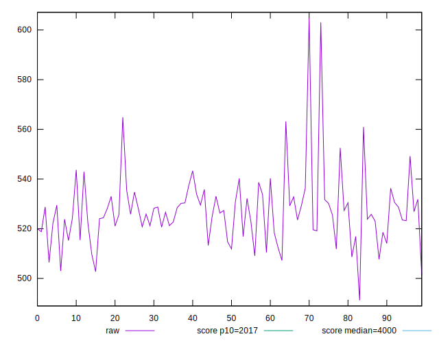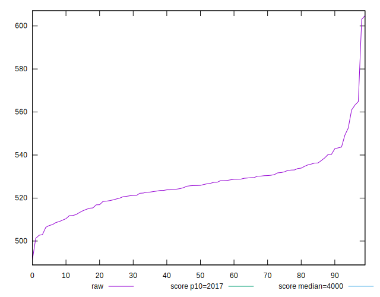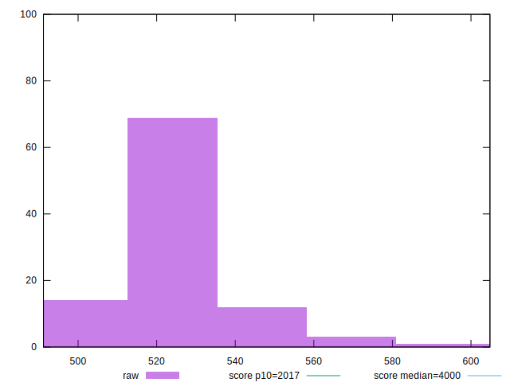
## Score


```yaml
p90min: 0.9998988977982426
p90max: 0.9999479565156418
p90range: 0.000049058717399241836
p90mean: 0.9999271697588686
p90median: 0.9999270316313172
p90stdev: 0.000009625486601339038
p90skewness: -0.22025035261996304
p90eccentricity: 0.9999999999999996
p90discretization: 1
outlandishness: 0.9999927539213233
confidence: 0.000008767407004617311
p90confidence: 0.000003955305965863687

```

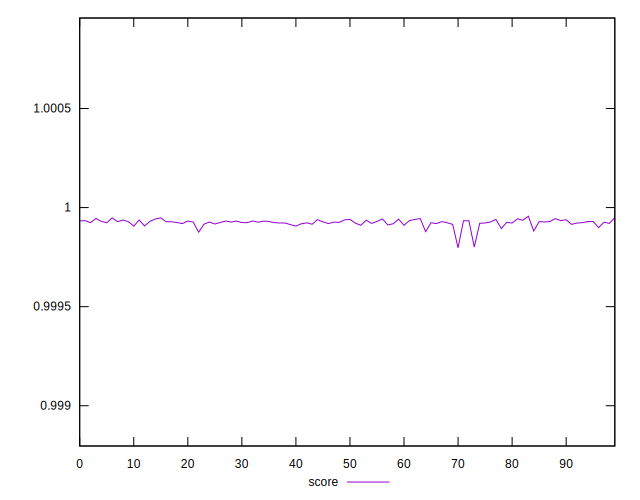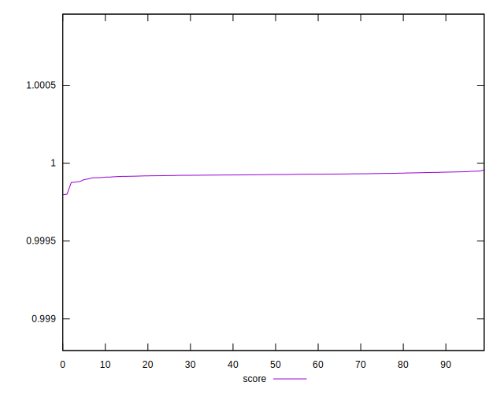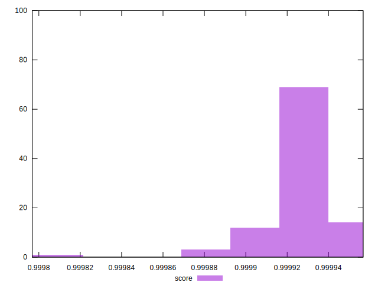
## Raw Estimate

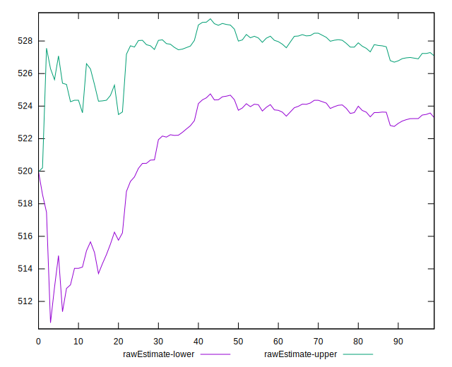
## Score Estimate

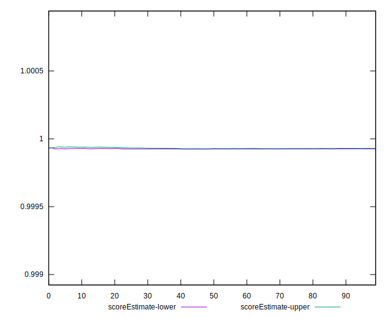
## P Score


```yaml
p90min: 0.9998988977982426
p90max: 0.9999479565156418
p90range: 0.000049058717399241836
p90mean: 0.9999271697588686
p90median: 0.9999270316313172
p90stdev: 0.000009625486601339038
p90skewness: -0.22025035261996304
p90eccentricity: 0.9999999999999996
p90discretization: 1
outlandishness: 0.9999927539213233
confidence: 0.000008767407004617311
p90confidence: 0.000003955305965863687

```

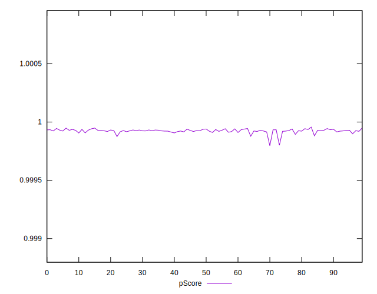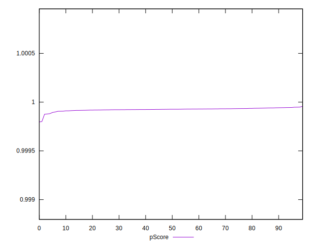
## Score Difference


```yaml
p90min: 0.0000520434843581663
p90max: 0.00010110220175740814
p90range: 0.000049058717399241836
p90mean: 0.00007283024113123395
p90median: 0.00007296836868275758
p90stdev: 0.000009625486601339038
p90skewness: 0.2202503527287127
p90eccentricity: 0.9999999999999997
p90discretization: 1
outlandishness: 1.1019600013803341
confidence: 0.000008767407004572534
p90confidence: 0.0000039553059658886235

```

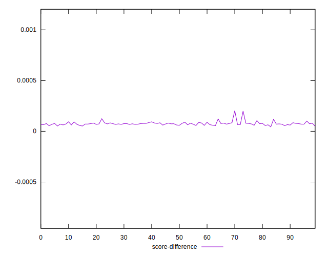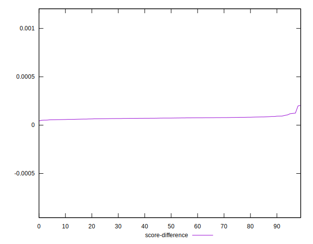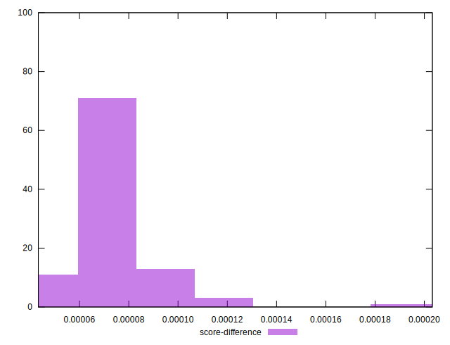
## P Score Difference


```yaml
p90min: 0
p90max: 0
p90range: 0
p90mean: 0
p90median: 0
p90stdev: 0
p90skewness: .nan
p90eccentricity: .nan
p90discretization: 91
outlandishness: .nan
confidence: 0
p90confidence: 0

```

