# //mainthread-work-breakdown/samples/pages+cached+noexternal+nosvg

[→ Parent](../..)


## Raw


```yaml
p90min: 743.9120000000004
p90max: 791.7320000000009
p90range: 47.820000000000505
p90mean: 767.2355164835168
p90median: 766.152
p90stdev: 13.988089977432965
p90skewness: 0.16705647953139274
p90eccentricity: 1.0000000000000002
p90discretization: 1
outlandishness: 1.0018293317972484
confidence: 7.489372446712423
p90confidence: 5.747987403715342

```

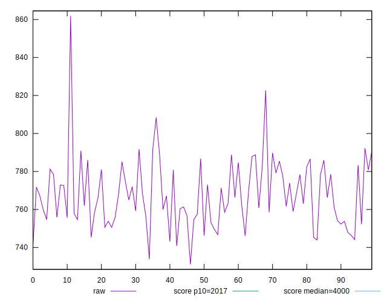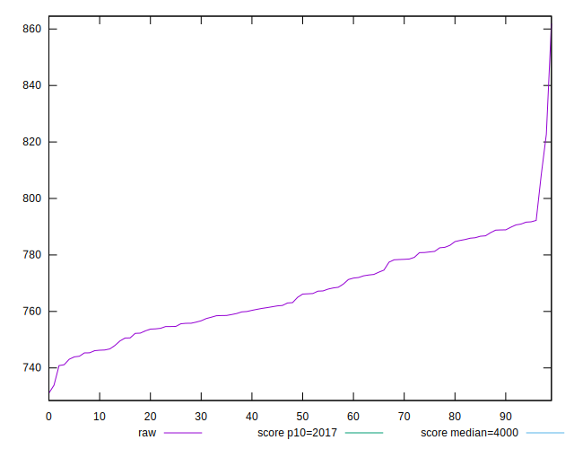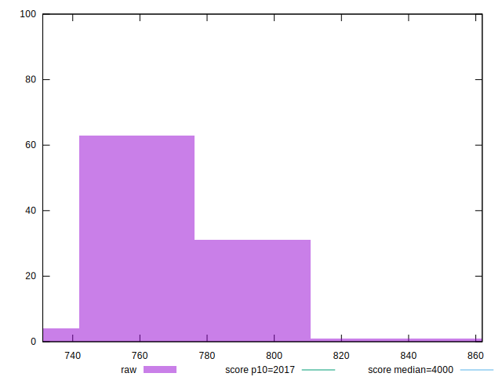
## Score


```yaml
p90min: 0.9987859781519028
p90max: 0.9991853563597434
p90range: 0.00039937820784052835
p90mean: 0.9990009817256604
p90median: 0.9990197438487018
p90stdev: 0.00011529687437628195
p90skewness: -0.27060097933062216
p90eccentricity: 1.0000000000000004
p90discretization: 1
outlandishness: 0.9999703049608517
confidence: 0.00006790975408565991
p90confidence: 0.000047377803736647905

```

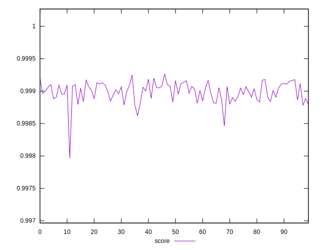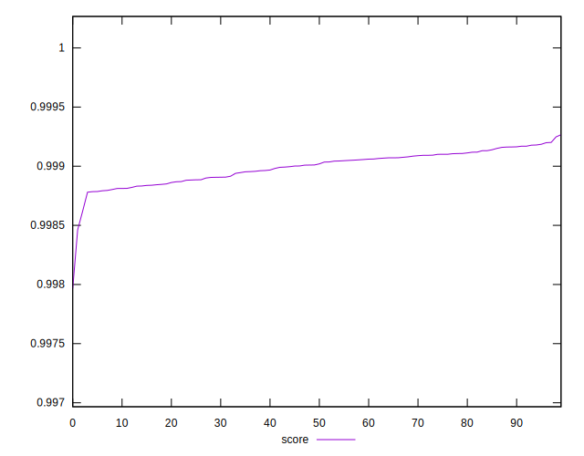
## Raw Estimate

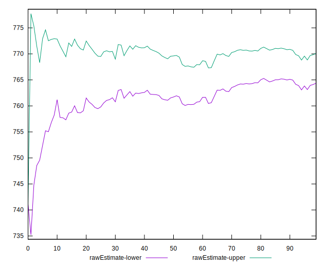
## Score Estimate

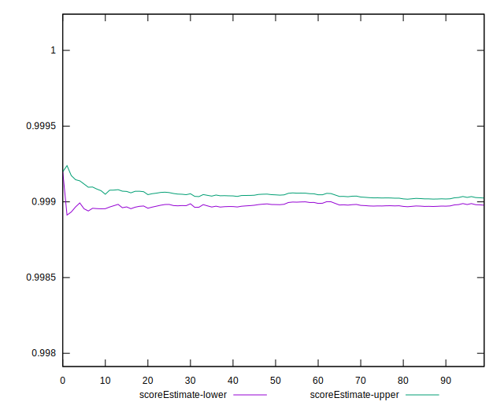
## P Score


```yaml
p90min: 0.9987859781519028
p90max: 0.9991853563597434
p90range: 0.00039937820784052835
p90mean: 0.9990009817256604
p90median: 0.9990197438487018
p90stdev: 0.00011529687437628195
p90skewness: -0.27060097933062216
p90eccentricity: 1.0000000000000004
p90discretization: 1
outlandishness: 0.9999703049608517
confidence: 0.00006790975408565991
p90confidence: 0.000047377803736647905

```

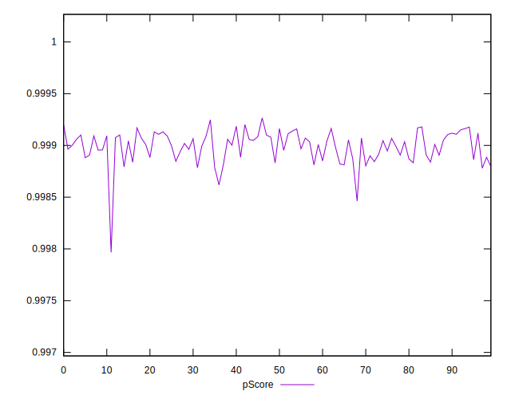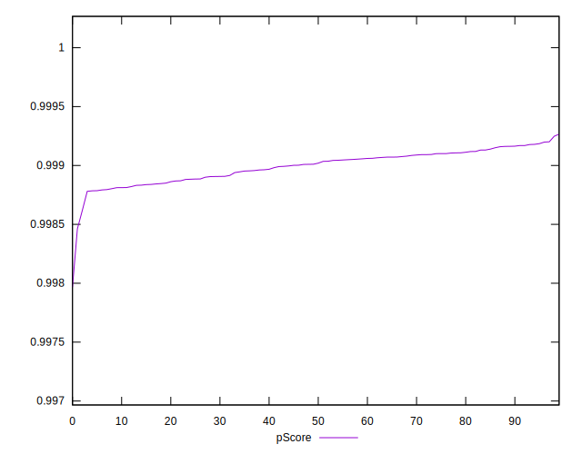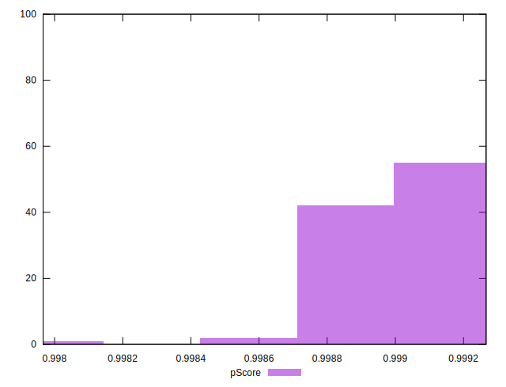
## Score Difference


```yaml
p90min: 0.0008146436402566293
p90max: 0.0012140218480971576
p90range: 0.00039937820784052835
p90mean: 0.0009990182743392277
p90median: 0.0009802561512981534
p90stdev: 0.00011529687437628199
p90skewness: 0.270600979330842
p90eccentricity: 0.9999999999999996
p90discretization: 1
outlandishness: 1.0299151900662398
confidence: 0.00006790975408567943
p90confidence: 0.00004737780373673551

```

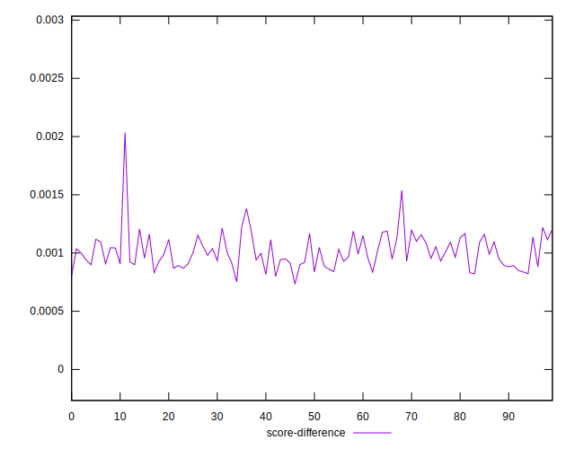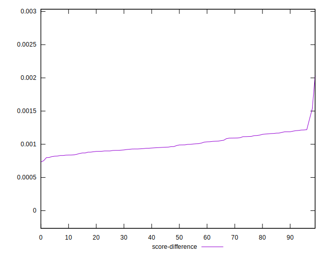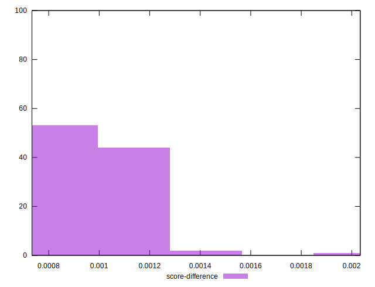
## P Score Difference


```yaml
p90min: 0
p90max: 0
p90range: 0
p90mean: 0
p90median: 0
p90stdev: 0
p90skewness: .nan
p90eccentricity: .nan
p90discretization: 91
outlandishness: .nan
confidence: 0
p90confidence: 0

```

