# //max-potential-fid/samples/pages+cached+noexternal+nofonts

[→ Parent](../..)


## Raw


```yaml
p90min: 26
p90max: 35
p90range: 9
p90mean: 29.406593406593405
p90median: 28
p90stdev: 3.165674491878147
p90skewness: 0.7663772130977172
p90eccentricity: 0.9999999999999981
p90discretization: 11.375
outlandishness: 1.0372996226352387
confidence: 1.366222837232371
p90confidence: 1.3008392949240815

```

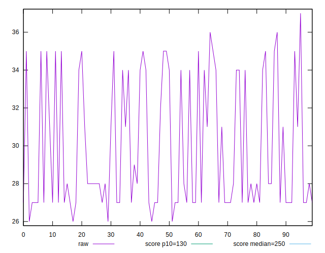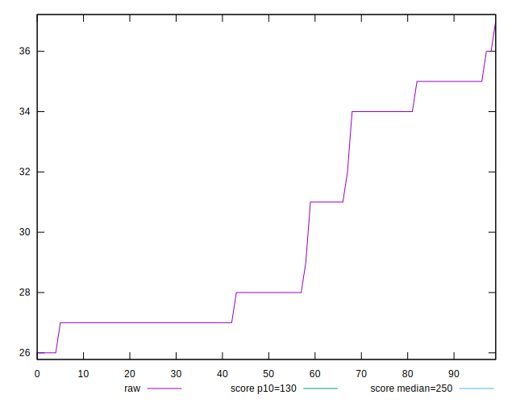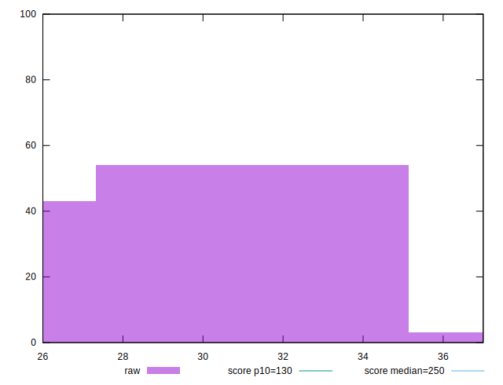
## Score


```yaml
p90min: 0.9999416738899494
p90max: 0.9999954072993993
p90range: 0.00005373340944991867
p90mean: 0.9999803777935234
p90median: 0.9999910785021199
p90stdev: 0.00001902603590970764
p90skewness: -1.056364356647117
p90eccentricity: 1.0000000000000002
p90discretization: 11.375
outlandishness: 0.9999918037102785
confidence: 0.000008849516408782065
p90confidence: 0.000007818180675744912

```

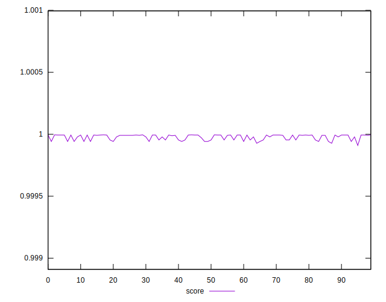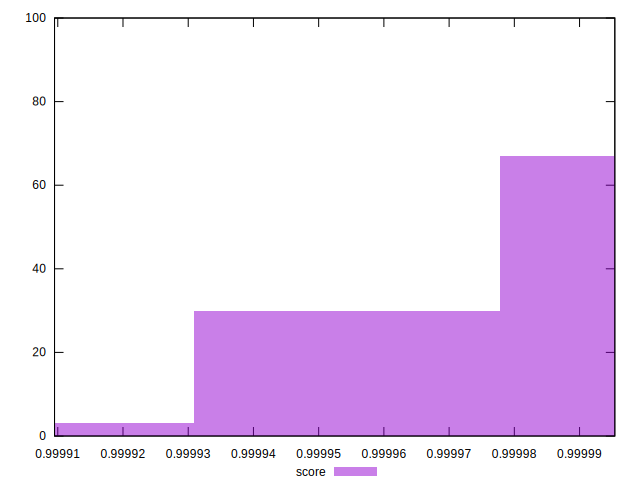
## Raw Estimate

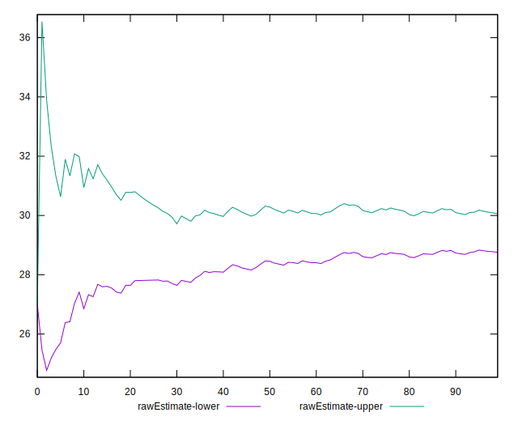
## Score Estimate

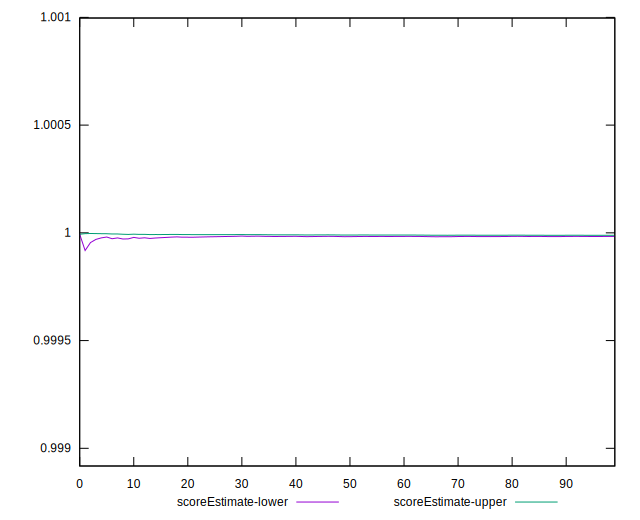
## P Score


```yaml
p90min: 0.9999416738899494
p90max: 0.9999954072993993
p90range: 0.00005373340944991867
p90mean: 0.9999803777935234
p90median: 0.9999910785021199
p90stdev: 0.00001902603590970764
p90skewness: -1.056364356647117
p90eccentricity: 1.0000000000000002
p90discretization: 11.375
outlandishness: 0.9999918037102785
confidence: 0.000008849516408782065
p90confidence: 0.000007818180675744912

```

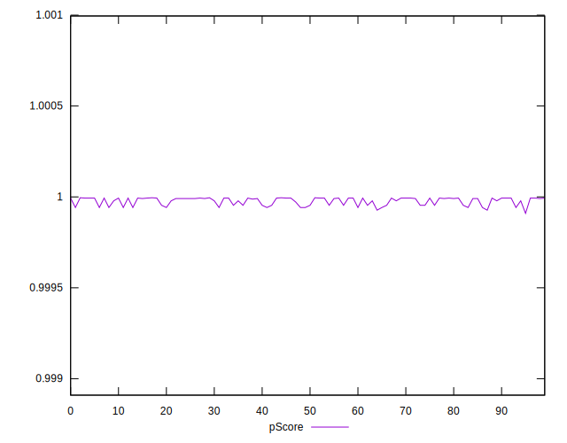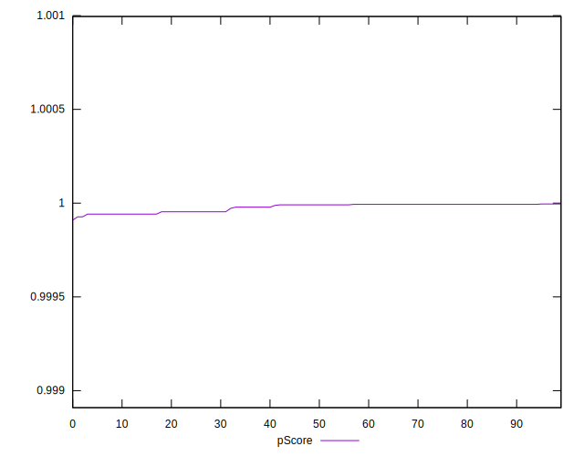
## Score Difference


```yaml
p90min: 0.000004592700600714039
p90max: 0.00005832611005063271
p90range: 0.00005373340944991867
p90mean: 0.000019622206477007624
p90median: 0.000008921497880121088
p90stdev: 0.000019026035909707635
p90skewness: 1.0563643565757492
p90eccentricity: 0.9999999999999996
p90discretization: 11.375
outlandishness: 1.4613152447675604
confidence: 0.000008849516408676762
p90confidence: 0.000007818180675708273

```

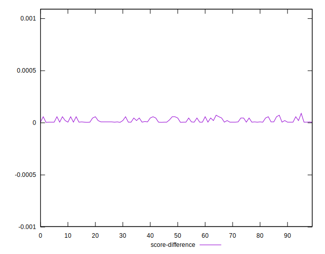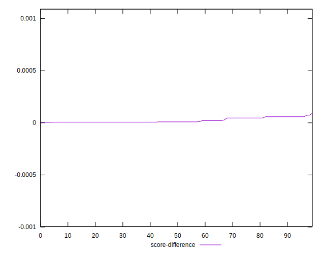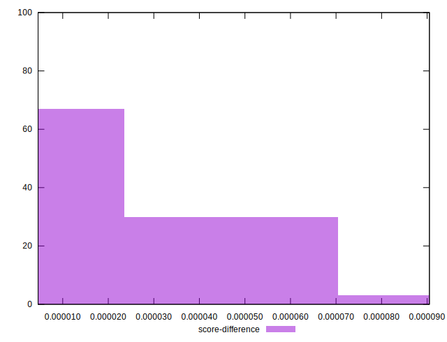
## P Score Difference


```yaml
p90min: 0
p90max: 0
p90range: 0
p90mean: 0
p90median: 0
p90stdev: 0
p90skewness: .nan
p90eccentricity: .nan
p90discretization: 91
outlandishness: .nan
confidence: 0
p90confidence: 0

```

