# //max-potential-fid/samples/pages+cached

[→ Parent](../..)


## Raw


```yaml
p90min: 269.9999999999982
p90max: 303.9999999999982
p90range: 34
p90mean: 284.10989010988993
p90median: 279
p90stdev: 11.916790767053309
p90skewness: 0.18427060224191733
p90eccentricity: 1.0000000000000002
p90discretization: 2.1666666666666665
outlandishness: 1.0171799915783468
confidence: 6.214642478042833
p90confidence: 4.896848914486554

```

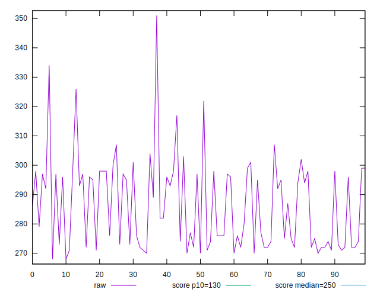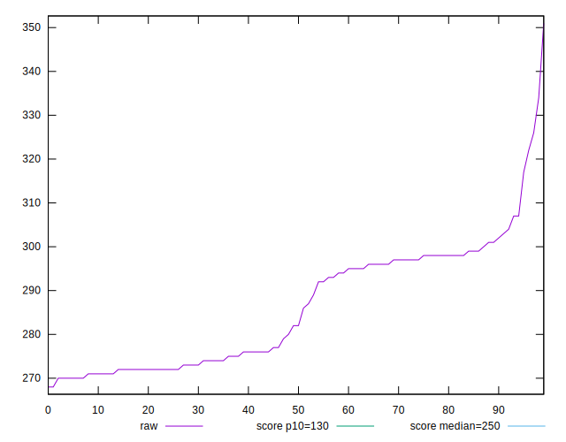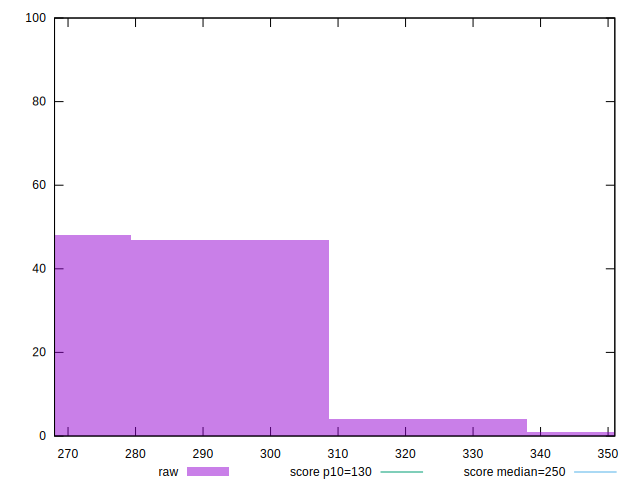
## Score


```yaml
p90min: 0.35076068472419847
p90max: 0.44005621242607357
p90range: 0.0892955277018751
p90mean: 0.4020322163574413
p90median: 0.41484959569195007
p90stdev: 0.03159908313361344
p90skewness: -0.1628709358659865
p90eccentricity: 0.9999999999999993
p90discretization: 2.1666666666666665
outlandishness: 0.9718957454191441
confidence: 0.01564700416204512
p90confidence: 0.012984698562419128

```

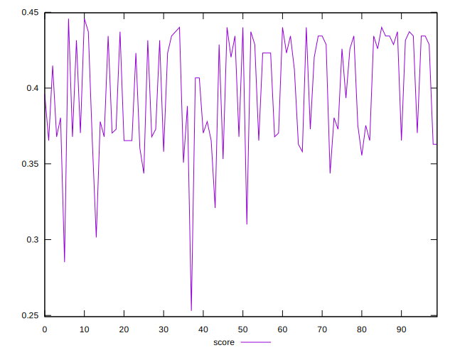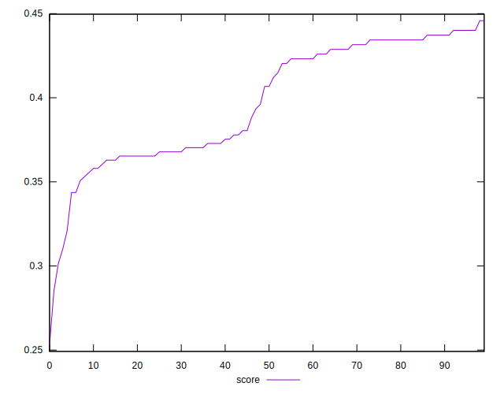
## Raw Estimate

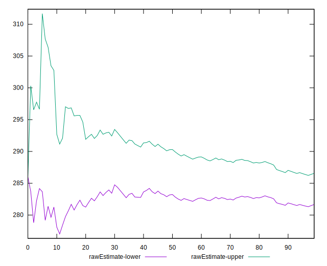
## Score Estimate

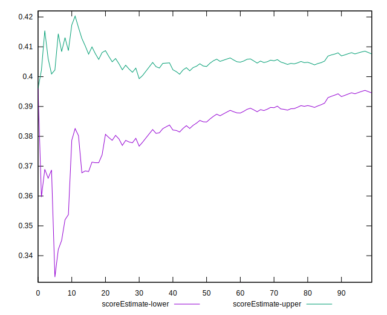
## P Score


```yaml
p90min: 0.35076068472419847
p90max: 0.44005621242607357
p90range: 0.0892955277018751
p90mean: 0.4020322163574413
p90median: 0.41484959569195007
p90stdev: 0.03159908313361344
p90skewness: -0.1628709358659865
p90eccentricity: 0.9999999999999993
p90discretization: 2.1666666666666665
outlandishness: 0.9718957454191441
confidence: 0.01564700416204512
p90confidence: 0.012984698562419128

```

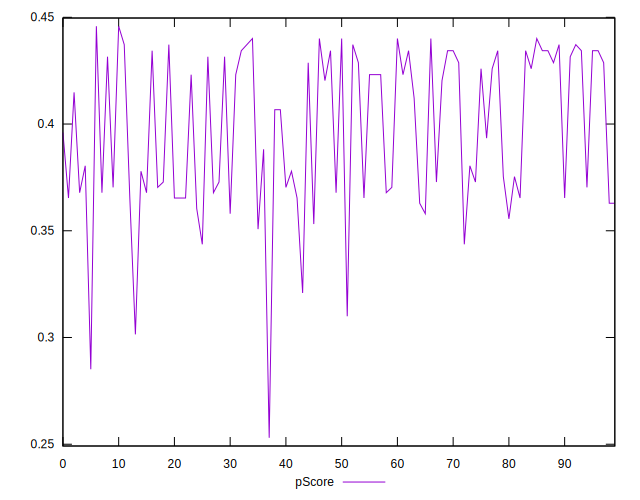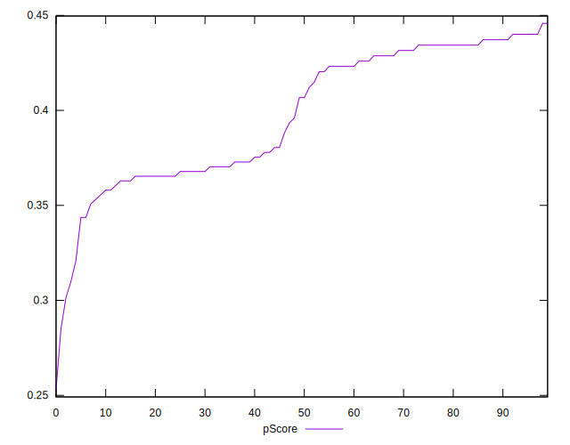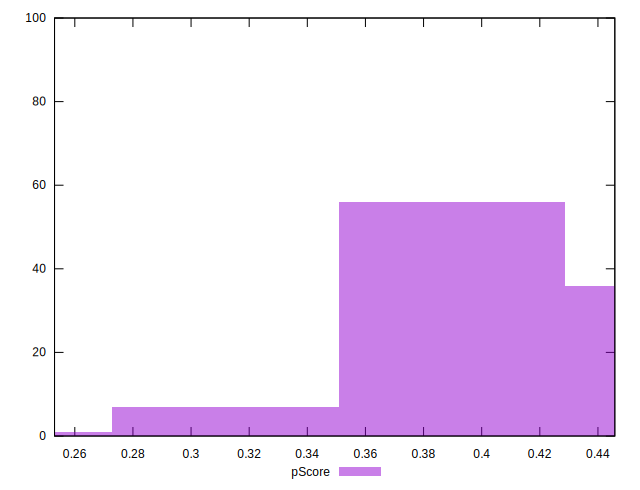
## Score Difference


```yaml
p90min: -0.004357845905361424
p90max: 0.0046523969202955096
p90range: 0.009010242825656933
p90mean: -0.0002951175394957092
p90median: -0.0003208536464964773
p90stdev: 0.0028965133764446986
p90skewness: 0.11482028279116317
p90eccentricity: 1.0000000000000002
p90discretization: 1.9782608695652173
outlandishness: 0.037898857920117233
confidence: 0.0012208228905644706
p90confidence: 0.0011902355810805602

```

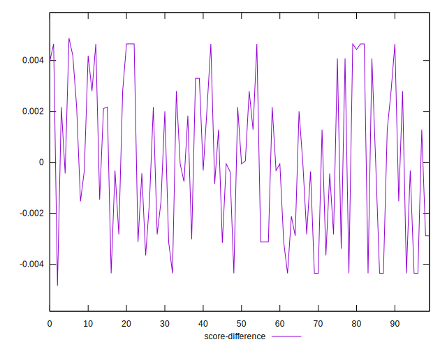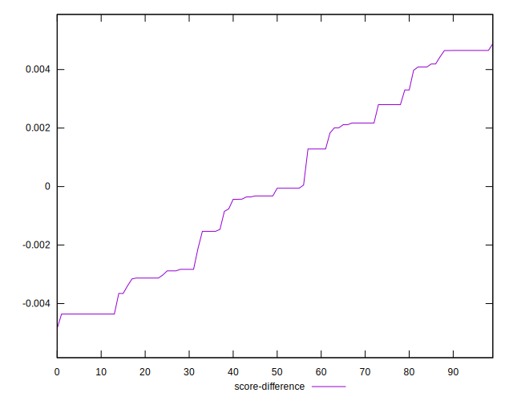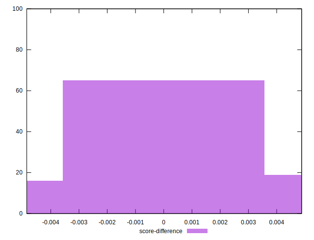
## P Score Difference


```yaml
p90min: 0
p90max: 0
p90range: 0
p90mean: 0
p90median: 0
p90stdev: 0
p90skewness: .nan
p90eccentricity: .nan
p90discretization: 91
outlandishness: .nan
confidence: 0
p90confidence: 0

```

