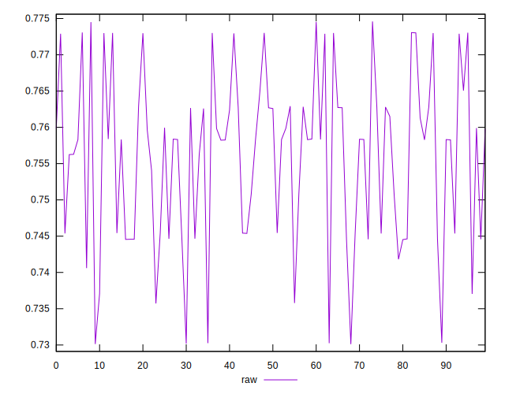
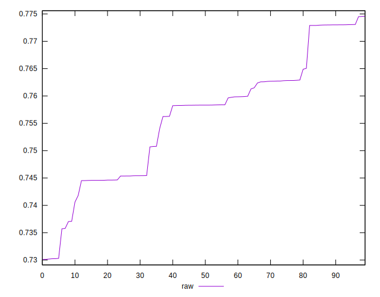
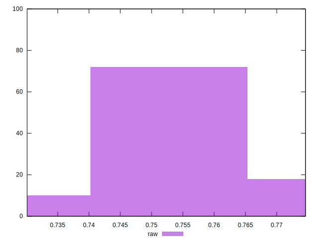

# //meta/pScore/samples/pages+cached+noexternal+nofonts

[→ Parent](../..)


## Raw


```yaml
p90min: 0.7370869583596307
p90max: 0.7745950872913464
p90range: 0.037508128931715734
p90mean: 0.7582192144828781
p90median: 0.7583762337749103
p90stdev: 0.010172523810313751
p90skewness: -0.06904425628497796
p90eccentricity: 0.9999999999999999
p90discretization: 1
outlandishness: 0.993832294980286
confidence: 0.0048064248421018085
p90confidence: 0.00418009455329571

```

