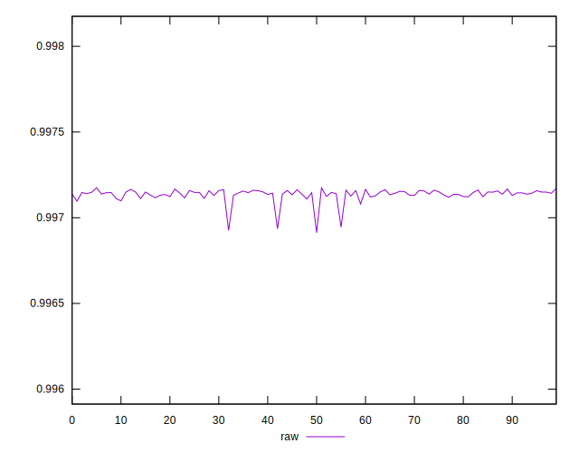
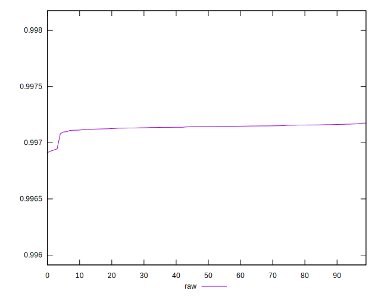
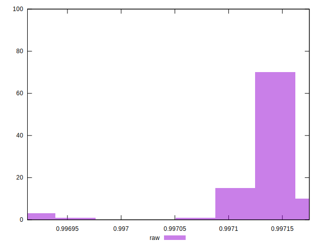

# //meta/pScore/samples/pages+cached+noexternal+nojs

[→ Parent](../..)


## Raw


```yaml
p90min: 0.9970981958903099
p90max: 0.9971673220230655
p90range: 0.00006912613275555923
p90mean: 0.9971422913900952
p90median: 0.9971449760532837
p90stdev: 0.000015076428616046936
p90skewness: -0.5121289243306535
p90eccentricity: 1
p90discretization: 1
outlandishness: 0.9999826746370154
confidence: 0.00001767658863771615
p90confidence: 0.000006195207631565225

```

